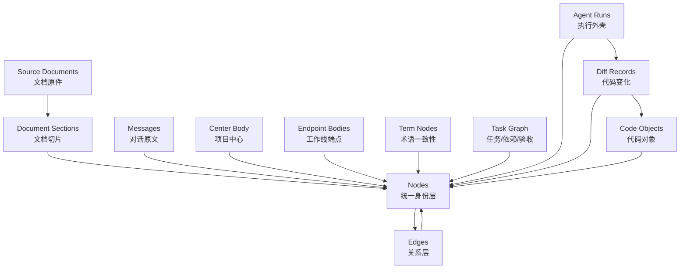
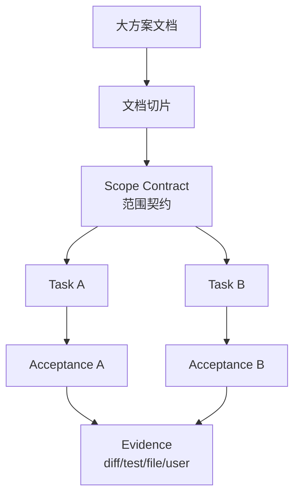
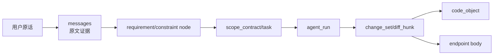
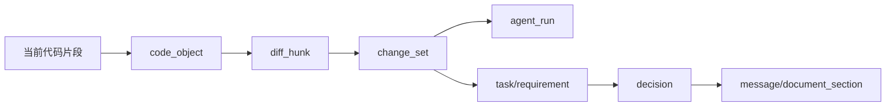
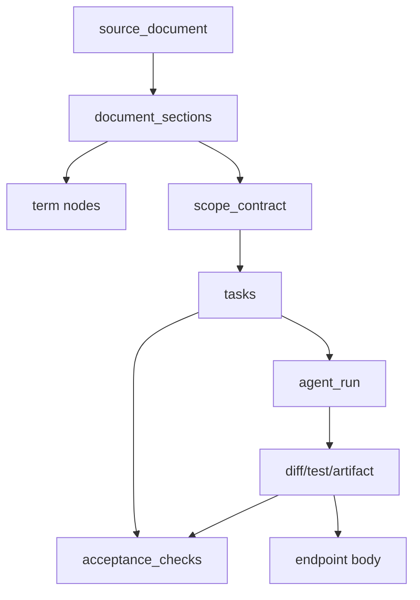

# shujuan 架构蓝图：Agent 项目记忆、因果图谱与工作 SOP

> 本文是对本轮讨论的完整沉淀。它不是“记忆库设计”，而是一个项目本地的 Agent 工作治理系统：用数据库、脚本和 SOP 共同改变 Agent 的注意力分配、行为规范和检索路径。

---

## 0. 执行前梳理：本轮对话沉淀出的价值点

这轮讨论最重要的价值，不是补充了几个表，而是澄清了 shujuan 的本质。

第一，shujuan 不是普通记忆库。普通记忆库容易变成“把过去说过的话再塞给 Agent”。shujuan 的目标更准确：让 Agent 在不同场景下被正确的证据、约束、端点、术语和执行链牵引。

第二，记忆系统真正产生作用的机制不是“知道前因后果”本身，而是三件事：Agent 的注意力分配、行为规范、检索路径。也就是说，shujuan 要让 Agent 先看该看的东西，按该走的流程行动，在需要追溯时能找到证据。

第三，中心 + 端点是激活核心。中心 body 负责项目身份和长期边界；端点 body 负责某条工作线当前走到哪里。Agent 不应该每次读取所有历史，也不应该依赖 Markdown 文件作为唯一入口。Markdown 可以导出，但数据库中的 body 才是 canonical source。

第四，脚本封装化是硬原则。凡是脚本能生成的内容，比如 session、prompt、diff、hash、时间、路径、run 起止、文件变化、切片索引，都必须由脚本生成。Agent 不应该被迫手填大量字段。

第五，Agent 轻量工作是硬原则。Agent 只应该做脚本做不了的语义工作：判断哪些原文形成需求、约束、决策；判断 edge 的语义关系；更新中心 body、端点 body、术语定义、任务分解和验收说明。过程性、无助于注意力管理的字段，尤其是依赖 Agent 主观判断的 status，不应成为核心字段。

第六，节点定义需要统一。节点不是“每一轮对话”，也不是“文档切片”，而是：任何需要被连接、追溯、激活、替代、验证的对象。对话原话、文档切片、术语、需求、决策、任务、验收项、Agent run、change_set、diff_hunk、代码对象，都可以是 node，只是 type 不同。

第七，文档机制必须加入。用户经常在网页端长讨论后生成一份大执行方案。这个方案不能直接变成巨大 node，也不能塞进中心 body。正确做法是：文档原件表保存全文，文档切片表拆成小段，再从切片中抽取语义节点、任务节点和验收节点。

第八，术语一致性记忆必须数据库化。术语不应该成为另一份 Markdown glossary，而应该接入 node/edge 体系。比如“中心”“端点”“body”“节点”“原文层”“执行契约”都应有 term node，定义、别名、误读、适用范围和来源都可追溯。

第九，shujuan 可以消解 Agent 偷换目标的问题，但不是通过“专门反 MVP”实现，而是通过完整 SOP：方案被拆成任务图、必须项、依赖项、验收项；Agent 每轮必须按证据收尾；无法把完整方案无痕降级为 MVP；如果需要缩小范围，必须留下 scope_change / defer_decision 类节点，并有来源证据。

第十，项目本地库是硬原则。每个项目一个本地数据库，减少跨项目污染，让记忆纯粹。通用的是 shujuan 的脚本、schema、SOP 和分发机制，不是把多个项目记忆混在一起。

---

## 1. shujuan 的总定义

shujuan 是一个项目本地的 Agent 工作治理系统。它由四部分组成：

1. 项目本地数据库：保存中心、端点、原文、文档、节点、关系、任务、执行、diff、代码对象、术语。
2. 脚本层：机械采集 prompt、transcript、diff、hash、文件路径、run snapshot、文档切片、hook event。
3. Agent 语义层：轻量判断需求、约束、决策、术语、任务、验收项和 edge 关系。
4. Skill SOP：规定 Agent 在不同场景下怎样读库、怎样写库、怎样执行、怎样收尾。

它的目标不是让 Agent “记住更多”，而是让 Agent：

- 不把当前问题从系统层偷换成局部字段问题。
- 不把完整方案偷换成 MVP。
- 不在没有证据时宣称完成。
- 不在新窗口里丢失关键上下文。
- 不被长上下文淹没。
- 不把术语重新解释一遍。
- 不只看眼前文件，而能看代码因果、影响面和历史约束。

一句话：shujuan 是 Agent 的“书记员 + 案卷系统 + 上下文路由器 + 执行纪律层”。

---

## 2. 基础原理与概念定义

### 2.1 记忆为什么会提升 Agent 工作质量

记忆本身不会自动提升质量。真正有效的是三层机制：

- 注意力分配：让 Agent 在开工前先看中心、端点、术语、相关约束、相关代码对象，而不是随机读文件或直接执行。
- 行为规范：强制 Agent 遵守 SOP，例如修改前查影响面，执行前读契约，收尾前检查验收项。
- 检索路径：让 Agent 知道不同场景该查哪里，而不是把所有历史都塞进上下文。

所以 shujuan 的记忆不是“越多越好”，而是“按场景激活”。

### 2.2 中心 body

中心 body 是项目的长期身份和边界。它回答：

- 这个项目是什么？
- 它不是什么？
- 哪些原则不能乱改？
- 当前最重要的方向是什么？
- 哪些术语和机制必须按项目内定义理解？

中心 body 不应记录临时 bug、按钮改动、一次执行失败。中心只有在项目身份、长期架构原则、核心边界变化时更新。

### 2.3 端点 body

端点 body 是某条工作线的当前状态。它回答：

- 这条线是什么？
- 当前走到哪里？
- 哪些结论已经确定？
- 哪些坑已经踩过？
- 下一轮从哪里继续？

端点不是全部历史，而是当前书签。Agent 进入任务时只加载相关端点，不加载所有端点。

### 2.4 node

node 是任何需要被连接、追溯、激活、替代、验证的对象。

node 不是单一类型。它可以是：

- 来源节点：conversation_turn、source_document、document_section。
- 语义节点：requirement、constraint、decision、term、assumption、unresolved_question。
- 执行节点：scope_contract、task、acceptance_check、procedure_step、agent_run。
- 代码节点：change_set、diff_hunk、file、symbol。
- 证据节点：test_result、artifact、user_confirmation。

node 的作用是“给对象发身份证”。

### 2.5 edge

edge 是两个 node 之间的关系。

如果 node 是名词，edge 就是动词。

例子：

```text
requirement --DERIVED_FROM--> document_section
change_set --IMPLEMENTS--> task
agent_run --EXECUTES--> task
new_decision --SUPERSEDES--> old_decision
term --APPLIES_TO--> endpoint_body
```

edge 的作用不是保存大段解释，而是保存明确关系。复杂关系要节点化，不能把所有语义塞进一条 edge 的 reason。

### 2.6 原文证据层

原文证据层保存用户原话、Agent 回复、工具返回、文档全文、文档切片、diff 原文。它不等于默认上下文。默认不读原文，只有追溯、冲突、校验、争议时才打开。

### 2.7 任务图

任务图是从文档、对话、方案中拆出来的执行结构。它包括：

- scope_contract：本次方案的范围契约。
- task：要做的任务。
- dependency：任务之间的依赖。
- acceptance_check：如何证明任务完成。
- evidence：完成证据，例如 diff、测试、文件、用户确认。

任务图的目的不是项目管理炫技，而是防止 Agent 把完整方案偷换成“先做个 MVP”。

### 2.8 术语一致性记忆

术语一致性记忆是 term node。它保存项目内核心词语的 canonical definition。

例如：

- “中心”不是 Markdown 文件，而是 active center body。
- “端点”不是 API endpoint，而是 workstream 当前状态 body。
- “节点”不是单纯一轮对话，而是可连接、可追溯、可激活对象。
- “原文层”是证据，不是默认上下文。

术语一致性记忆减少新窗口里的词义漂移。

### 2.9 本地项目库

每个项目一个数据库。推荐目录：

```text
<repo>/.shujuan/
  shujuan.db 或 postgres connection config
  schema_version.json
  exports/
    center.md
    endpoints/
    glossary.md
  patches/
  artifacts/
  logs/
```

如果使用 PostgreSQL，可每个项目一个 database 或 schema；如果使用 PGlite/SQLite，可每个项目一个本地文件库。原则是项目记忆不混库。

---

## 3. 总体拓扑



---

## 4. 数据库设计总原则

### 4.1 字段精简原则

字段只保留三类：

1. 事实字段：脚本能稳定生成，例如时间、hash、路径、content、commit、diff、line range。
2. 激活字段：直接帮助 Agent 读库，例如 body、summary、node type、edge type。
3. 追溯字段：帮助回到证据，例如 node_id、source_node_id、evidence_node_id。

避免字段：

- 依赖 Agent 主观判断但又无助于行动的 status。
- 重复表达前面已有关系的 intent。
- 让 Agent 每轮都要手填的过程字段。

生命周期尽量用 edge 表达：

- `new_decision --SUPERSEDES--> old_decision`
- `rollback_change_set --REVERTS--> old_change_set`
- `test_result --VALIDATES--> change_set`
- `scope_change --DEFERRED--> task`

### 4.2 node_id 规则

凡是可能进入图谱关系的 detail row，都应有 `node_id`。

例如：

- `messages.node_id`
- `document_sections.node_id`
- `agent_runs.node_id`
- `change_sets.node_id`
- `diff_hunks.node_id`
- `code_objects.node_id`
- `terms.node_id`
- `tasks.node_id`

这样普通表保存具体内容，nodes 保存统一身份，edges 保存对象关系。

### 4.3 脚本与 Agent 分工

脚本负责：

- id、时间、hash、路径、line range、patch、snapshot。
- prompt / transcript / document / diff 的机械导入。
- 文档初步切片。
- Git diff 解析。
- 文件和代码对象扫描。
- embedding / full-text index 的后台生成。

Agent 负责：

- 节点语义分类。
- edge 关系判断。
- 中心 body 更新。
- 端点 body 更新。
- 术语定义更新。
- 任务拆解、验收项描述。
- 冲突、替代、范围变更的语义判断。

---

## 5. 核心表设计

下面是逻辑 schema。实现时可用 PostgreSQL/PGlite/SQLite 近似表达，但关系、hash、node_id、edge 必须保留。

### 5.1 项目表：`project_meta`

每个项目本地库中通常只有一条。

| 字段 | 含义 | 生成方式 |
|---|---|---|
| `id` | 项目 ID | 脚本 |
| `name` | 项目名 | init 时写入 |
| `repo_root` | 仓库根目录 | 脚本检测 |
| `default_branch` | 默认分支 | Git 检测 |
| `schema_version` | shujuan schema 版本 | 脚本 |
| `created_at` | 创建时间 | 脚本 |

### 5.2 中心表：`center_bodies`

中心 body 是项目身份，不是 Markdown 文件。

| 字段 | 含义 | 生成方式 |
|---|---|---|
| `id` | 中心 body 版本 ID | 脚本 |
| `node_id` | 对应 center_body node | 脚本 |
| `body` | 中心正文 | Agent 维护 |
| `version` | 版本号 | 脚本 |
| `is_current` | 当前是否启用 | 脚本 |
| `created_from_node_id` | 由哪个决策/文档/对话触发 | edge/脚本 |
| `created_at` | 创建时间 | 脚本 |

中心更新规则：只有项目身份、长期边界、核心原则变化时才更新。

### 5.3 端点表：`endpoints` 与 `endpoint_bodies`

`endpoints` 是工作线，`endpoint_bodies` 是这条线的当前/历史 body。

`endpoints`：

| 字段 | 含义 | 生成方式 |
|---|---|---|
| `id` | 工作线 ID | 脚本 |
| `node_id` | 对应 endpoint node | 脚本 |
| `name` | 工作线名 | Agent/脚本 |
| `description` | 工作线说明 | Agent |
| `root_node_id` | 从哪个节点开始 | edge/脚本 |
| `current_body_id` | 当前端点 body | 脚本 |
| `created_at` | 创建时间 | 脚本 |
| `archived_at` | 归档时间，可空 | 脚本/用户 |

`endpoint_bodies`：

| 字段 | 含义 | 生成方式 |
|---|---|---|
| `id` | body 版本 ID | 脚本 |
| `endpoint_id` | 属于哪条线 | 脚本 |
| `node_id` | 对应 endpoint_body node | 脚本 |
| `body` | 当前状态正文 | Agent |
| `created_from_node_id` | 由哪个节点触发更新 | edge/脚本 |
| `created_at` | 创建时间 | 脚本 |

端点 body 记录“现在走到哪”，不塞完整历史。

### 5.4 对话原文：`conversation_sessions` 与 `messages`

`conversation_sessions` 保存会话外壳。

| 字段 | 含义 | 生成方式 |
|---|---|---|
| `id` | 会话 ID | hook/脚本 |
| `agent_name` | codex / claude-code / other | 脚本 |
| `model_name` | 模型名 | hook/脚本 |
| `source` | 来源 | 脚本 |
| `started_at` | 开始时间 | 脚本 |
| `ended_at` | 结束时间 | 脚本 |
| `metadata` | 原始 hook 信息 | 脚本 |

`messages` 保存每句话原文。

| 字段 | 含义 | 生成方式 |
|---|---|---|
| `id` | 消息 ID | 脚本 |
| `session_id` | 所属会话 | hook/脚本 |
| `node_id` | 对应 conversation_turn node | 脚本 |
| `actor` | user / agent / tool / system | 脚本 |
| `content` | 原文 | 脚本机械复制 |
| `content_hash` | 内容指纹 | 脚本 |
| `turn_index` | 会话内顺序 | 脚本 |
| `created_at` | 时间 | 脚本 |
| `metadata` | 原始事件 | 脚本 |

LLM 不负责搬运原文。原文必须通过 hook、transcript parser 或文件导入机械保存。

### 5.5 文档机制：`source_documents` 与 `document_sections`

`source_documents` 保存文档原件。

| 字段 | 含义 | 生成方式 |
|---|---|---|
| `id` | 文档 ID | 脚本 |
| `node_id` | 对应 source_document node | 脚本 |
| `title` | 文档标题 | 脚本/Agent |
| `source_type` | markdown / web_copy / plan / manual | 脚本 |
| `origin` | 路径、URL、来源说明 | 脚本 |
| `body` | 完整原文 | 脚本 |
| `content_hash` | 文档 hash | 脚本 |
| `imported_at` | 导入时间 | 脚本 |
| `metadata` | 额外信息 | 脚本 |

`document_sections` 保存切片。

| 字段 | 含义 | 生成方式 |
|---|---|---|
| `id` | 切片 ID | 脚本 |
| `document_id` | 所属文档 | 脚本 |
| `node_id` | 对应 document_section node | 脚本 |
| `section_index` | 顺序 | 脚本 |
| `heading` | 小标题 | 脚本/Agent |
| `body` | 切片正文 | 脚本 |
| `start_offset` | 原文起点 | 脚本 |
| `end_offset` | 原文终点 | 脚本 |
| `content_hash` | 切片 hash | 脚本 |

文档乱也没关系。先完整收原件，再切片；切片错了可重切；语义抽取错了只改节点和 edge，不污染原文。

### 5.6 节点表：`nodes`

| 字段 | 含义 | 生成方式 |
|---|---|---|
| `id` | 节点 ID | 脚本 |
| `type` | 节点类型 | 规则/Agent |
| `label` | 短名 | Agent/脚本 |
| `summary` | 一句话说明 | Agent |
| `created_at` | 创建时间 | 脚本 |
| `updated_at` | 更新时间 | 脚本 |
| `valid_from` | 何时开始有效，可空 | 脚本/Agent |
| `valid_to` | 何时失效，可空 | edge 推导/脚本 |
| `superseded_by_node_id` | 被谁替代，可空 | edge 推导 |
| `embedding` | 语义向量 | 后台脚本 |
| `search_tsv` | 全文索引 | 数据库/脚本 |
| `props` | 额外属性 | 脚本 |

没有通用 `status`。是否被替代、回滚、验证、否定，尽量由 edge 表达。

推荐 node type：

```text
center_body
endpoint
endpoint_body
conversation_turn
source_document
document_section
term
requirement
constraint
preference
decision
assumption
unresolved_question
scope_contract
scope_change
task
procedure_step
acceptance_check
agent_run
command_event
change_set
diff_hunk
file
symbol
test_result
artifact
user_confirmation
```

### 5.7 边表：`edges`

| 字段 | 含义 | 生成方式 |
|---|---|---|
| `id` | 关系 ID | 脚本 |
| `from_node_id` | 主语节点 | 脚本/Agent |
| `type` | 关系类型 | 脚本/Agent |
| `to_node_id` | 宾语节点 | 脚本/Agent |
| `reason` | 简短理由 | Agent |
| `confidence` | 置信度，可空 | 脚本/Agent |
| `evidence_node_id` | 证据节点，可空 | 脚本/Agent |
| `created_by` | script / agent / user | 脚本 |
| `created_at` | 创建时间 | 脚本 |
| `props` | 额外信息 | 脚本 |

推荐 edge type：

```text
DERIVED_FROM        语义节点来自某原文/文档切片
MENTIONS            提到，但不一定形成需求
DEFINES             术语节点定义某概念
APPLIES_TO          术语/约束适用于某端点/任务
CONSTRAINED_BY      受某约束限制
DECOMPOSES_TO       方案/契约拆成任务
DEPENDS_ON          任务依赖任务
EXECUTES            agent_run 执行任务
PRODUCES            agent_run 产生 change_set / artifact
IMPLEMENTS          change_set 实现任务/需求
MODIFIES            change_set 修改代码对象
AFFECTS             影响某代码对象/模块/测试
VALIDATED_BY        被测试/验收/用户确认验证
BLOCKED_BY          被某问题阻塞
CONFLICTS_WITH      与某节点冲突
SUPERSEDES          替代旧节点
REVERTS             回滚某变更
CONTINUES           继续某端点/任务
BRANCHES_FROM       从某中心/端点分叉
DEFERRED_BY         任务被某范围变更延后
```

硬规则：edge 永远读成 `from_node 是主语，type 是动词，to_node 是宾语`。

### 5.8 执行外壳：`agent_runs` 与 `run_snapshots`

`agent_runs` 记录“这一轮 Agent 真的开始干活了”。纯讨论不生成 agent_run。

| 字段 | 含义 | 生成方式 |
|---|---|---|
| `id` | run ID | 脚本 |
| `node_id` | 对应 agent_run node | 脚本 |
| `session_id` | 来源会话 | hook/脚本 |
| `agent_name` | 执行 Agent | 脚本 |
| `model_name` | 模型 | 脚本 |
| `started_at` | 开始时间 | 脚本 |
| `ended_at` | 结束时间 | 脚本 |
| `base_commit` | 开始时 Git HEAD | 脚本 |
| `end_head_commit` | 结束时 Git HEAD，可空 | 脚本 |
| `final_report` | Agent 最后简报 | 脚本复制/Agent |
| `metadata` | hook / env / cwd | 脚本 |

没有 `status`。是否完成、失败、部分完成，由任务验收、测试、diff、用户确认和 edge 推导。

`run_snapshots` 记录执行前后现场。

| 字段 | 含义 | 生成方式 |
|---|---|---|
| `id` | snapshot ID | 脚本 |
| `run_id` | 所属 run | 脚本 |
| `phase` | before / after | 脚本 |
| `head_commit` | 当前 HEAD | 脚本 |
| `worktree_patch_hash` | 工作区 diff hash | 脚本 |
| `staged_patch_hash` | 暂存区 diff hash | 脚本 |
| `patch_ref` | patch 文件路径，可空 | 脚本 |
| `captured_at` | 捕获时间 | 脚本 |

run snapshot 解决“执行前工作区已脏”的问题。本轮 change_set 应尽量由 after_snapshot 减 before_snapshot 得到。

### 5.9 代码变更：`change_sets`、`diff_files`、`diff_hunks`

`change_sets` 是一包客观 diff，不保存 intent，不保存 status。

| 字段 | 含义 | 生成方式 |
|---|---|---|
| `id` | change_set ID | 脚本 |
| `node_id` | 对应 change_set node | 脚本 |
| `run_id` | 来自哪次 run | 脚本 |
| `base_snapshot_id` | 前现场 | 脚本 |
| `after_snapshot_id` | 后现场 | 脚本 |
| `patch_hash` | 整包 diff 指纹 | 脚本 |
| `summary` | 简短变化说明 | Agent，可空 |
| `created_at` | 创建时间 | 脚本 |
| `metadata` | 原始 diff 信息 | 脚本 |

`diff_files`：

| 字段 | 含义 | 生成方式 |
|---|---|---|
| `id` | 文件变更 ID | 脚本 |
| `change_set_id` | 所属 change_set | 脚本 |
| `path_old` | 旧路径 | 脚本 |
| `path_new` | 新路径 | 脚本 |
| `change_type` | added / modified / deleted / renamed | 脚本 |
| `additions` | 新增行数 | 脚本 |
| `deletions` | 删除行数 | 脚本 |
| `file_hash_before` | 改前文件 hash | 脚本 |
| `file_hash_after` | 改后文件 hash | 脚本 |

`diff_hunks`：

| 字段 | 含义 | 生成方式 |
|---|---|---|
| `id` | hunk ID | 脚本 |
| `diff_file_id` | 所属文件变更 | 脚本 |
| `node_id` | 对应 diff_hunk node | 脚本 |
| `old_start` / `old_lines` | 旧文件位置 | 脚本 |
| `new_start` / `new_lines` | 新文件位置 | 脚本 |
| `hunk_header` | Git diff header | 脚本 |
| `old_text` | 变更前文本 | 脚本 |
| `new_text` | 变更后文本 | 脚本 |
| `context_text` | 上下文 | 脚本 |
| `hunk_hash` | hunk 指纹 | 脚本 |
| `summary` | 简短说明 | Agent，可空 |

diff 不依赖 commit。commit 是 Git 正式历史；diff 是 shujuan 的执行事实。每轮不应强制 commit。

### 5.10 代码对象：`code_objects` 与 `change_code_links`

`code_objects` 记录真实代码世界里的文件、函数、类、组件、路由、表等。

| 字段 | 含义 | 生成方式 |
|---|---|---|
| `id` | 代码对象 ID | 脚本 |
| `node_id` | 对应 file/symbol node | 脚本 |
| `type` | file / function / class / component / route / table | parser/脚本 |
| `path` | 文件路径 | 脚本 |
| `symbol_name` | 符号名 | parser |
| `qualified_name` | 完整名 | parser |
| `language` | 语言 | 脚本 |
| `start_line` / `end_line` | 当前定位 | parser |
| `content_hash` | 内容指纹 | 脚本 |
| `last_seen_commit` | 最后见到的 commit | 脚本 |
| `archived_at` | 不再出现时记录，可空 | 脚本 |
| `props` | 额外信息 | 脚本 |

`change_code_links`：

| 字段 | 含义 | 生成方式 |
|---|---|---|
| `id` | 关系 ID | 脚本 |
| `change_set_id` | 变更包 | 脚本 |
| `code_object_id` | 代码对象 | 脚本/Agent |
| `relation_type` | modifies / creates / deletes / refactors / configures | 脚本/Agent |
| `confidence` | 置信度 | 脚本/Agent |
| `evidence_hunk_id` | 证据 hunk | 脚本 |

行号只作为坐标，不是永久身份证。真实追踪要组合 path、symbol、content_hash、hunk_hash、context_text、commit/blame 和 change_set 链。

### 5.11 术语机制：`terms`

术语接入 node 体系。

| 字段 | 含义 | 生成方式 |
|---|---|---|
| `id` | term ID | 脚本 |
| `node_id` | 对应 term node | 脚本 |
| `canonical_term` | 标准术语 | Agent/用户 |
| `definition` | 定义 | Agent/用户 |
| `avoid_aliases` | 避免混用的别名 | Agent |
| `ambiguity_notes` | 易误读说明 | Agent |
| `scope_node_id` | 适用范围，例如某 endpoint | Agent |
| `created_from_node_id` | 来源 | edge/脚本 |
| `valid_from` | 生效时间 | 脚本 |
| `valid_to` | 失效时间 | edge 推导 |

术语变更不直接覆盖旧定义，应通过 `SUPERSEDES` 或 `CONFLICTS_WITH` 保留历史。

### 5.12 任务与执行契约：`scope_contracts`、`tasks`、`acceptance_checks`

`scope_contracts` 保存某份方案的范围契约。

| 字段 | 含义 | 生成方式 |
|---|---|---|
| `id` | 契约 ID | 脚本 |
| `node_id` | 对应 scope_contract node | 脚本 |
| `source_node_id` | 来源文档/对话 | 脚本 |
| `body` | 契约正文 | Agent |
| `non_downgrade_rules` | 不得擅自降级规则 | Agent |
| `created_at` | 创建时间 | 脚本 |

`tasks`：

| 字段 | 含义 | 生成方式 |
|---|---|---|
| `id` | task ID | 脚本 |
| `node_id` | 对应 task node | 脚本 |
| `contract_id` | 所属契约 | 脚本 |
| `parent_task_id` | 父任务，可空 | 脚本/Agent |
| `task_body` | 任务说明 | Agent |
| `is_mandatory` | 是否必须项 | Agent 从证据推导 |
| `created_from_node_id` | 来源 | edge/脚本 |
| `closed_by_node_id` | 完成证据，可空 | 脚本/Agent |
| `closed_at` | 关闭时间，可空 | 脚本 |

`acceptance_checks`：

| 字段 | 含义 | 生成方式 |
|---|---|---|
| `id` | 验收项 ID | 脚本 |
| `node_id` | 对应 acceptance_check node | 脚本 |
| `task_id` | 所属任务 | 脚本 |
| `check_body` | 验收描述 | Agent |
| `expected_evidence_type` | diff / test / file / user_confirmation / doc_update | Agent |
| `closed_by_node_id` | 实际证据，可空 | 脚本/Agent |
| `closed_at` | 验收时间，可空 | 脚本 |

没有“任务 status”。是否完成由 `closed_by_node_id` 是否存在，以及 `VALIDATED_BY` edge 推导。

### 5.13 激活日志：`activation_logs`

记录 Agent 每次读了什么，便于复盘。

| 字段 | 含义 | 生成方式 |
|---|---|---|
| `id` | 激活记录 ID | 脚本 |
| `task_text` | 本轮用户任务 | 脚本 |
| `loaded_center_body_id` | 加载的中心 | 脚本 |
| `loaded_endpoint_body_ids` | 加载的端点 | 脚本 |
| `loaded_term_node_ids` | 加载的术语 | 脚本 |
| `loaded_node_ids` | 额外节点 | 脚本 |
| `reason` | 为什么加载 | Agent/脚本 |
| `created_at` | 时间 | 脚本 |

---

## 6. Skill SOP：读库规则

读库是 shujuan 的核心。不能让 Agent 自由漫游数据库，必须按场景激活。

### 6.1 默认进入项目

加载：

1. 当前 center body。
2. 与任务语义最相关的 1–5 个 endpoint body。
3. 与任务关键词/术语相关的 term nodes。
4. 必要的 unresolved_question / constraint / decision nodes。

不加载：

- 全部 messages。
- 全部 diff。
- 全部 endpoints。
- 全部文档原文。

### 6.2 继续某条工作线

加载：

- center body。
- 目标 endpoint body。
- endpoint 当前 tip 相关节点。
- tip 前后 2–5 跳图谱。
- 未关闭任务和验收项。

### 6.3 代码修改场景

加载：

- center body。
- 相关 endpoint。
- 相关 term nodes。
- 目标 file/symbol 的 code_object。
- 该 code_object 最近 change_set。
- 相关 decision / requirement / constraint。
- 如果要改动范围大，再触发影响面检查。

### 6.4 “为什么这段代码存在”场景

流程：

1. 用 path + symbol + current snippet 定位 code_object。
2. 找最近相关 diff_hunk / change_set。
3. 追溯 change_set → agent_run → task / requirement / decision。
4. 必要时打开 message / document_section 原文证据。
5. 输出时区分事实、推断和不确定处。

### 6.5 文档执行场景

流程：

1. 导入 source_document。
2. 切成 document_sections。
3. 抽取 scope_contract、constraint、decision、task、acceptance_check。
4. 建立 `node --DERIVED_FROM--> document_section`。
5. 只加载当前任务相关切片和节点，不加载整份大文档。

### 6.6 术语冲突场景

当用户纠正术语，或 Agent 发现术语混乱：

1. 查 term node。
2. 如果旧定义错误，生成新 term node 或更新 term detail。
3. 用 `SUPERSEDES` 连接旧定义。
4. 用 `DERIVED_FROM` 连接用户纠正原话。
5. 将相关术语加入下一轮激活。

### 6.7 对话探索场景

不强行生成任务图。加载：

- center body。
- 相关端点。
- 相关术语。
- unresolved_question。
- 最近关键 decision。

产出：

- 新术语。
- 新约束。
- 新决策。
- 未解决张力。
- 必要时更新端点 body。

### 6.8 架构设计场景

加载：

- center body。
- 相关 decision / constraint / term。
- 相关文档 section。
- 冲突关系 `CONFLICTS_WITH`。
- 替代关系 `SUPERSEDES`。

产出：

- 方案节点。
- 决策节点。
- 约束节点。
- scope_contract 或 endpoint 更新。

---

## 7. Skill SOP：写库规则

### 7.1 对话写入

每次用户 prompt 进入时：

- hook 脚本保存原文到 messages。
- 生成 conversation_turn node。
- content_hash 去重。
- 不让 Agent 重写原文。

Agent 回复或工具返回：

- hook / transcript parser 保存。
- 重要内容可生成 node。
- 普通闲聊可只保存 message，不生成语义节点。

### 7.2 文档写入

导入文档时：

1. 原件进入 `source_documents`。
2. 自动计算 hash。
3. 自动切片进入 `document_sections`。
4. 每个 section 生成 document_section node。
5. Agent 只对关键 section 做语义抽取。

### 7.3 执行开始

当 Agent 真正开始修改文件、运行命令、生成 artifact 时：

1. 创建 agent_run。
2. 捕获 before snapshot。
3. 记录 base_commit、worktree patch hash、staged patch hash。
4. 记录 activation_log。

纯讨论不生成 agent_run。

### 7.4 执行结束

执行结束时：

1. 捕获 after snapshot。
2. 计算本轮新增 diff。
3. 生成 change_set、diff_files、diff_hunks。
4. 扫描 code_objects。
5. 建立 change_set 与 code_object 的链接。
6. Agent 写短 summary，但不搬运 diff 原文。
7. 建立 edge：task/requirement/decision/change_set/agent_run/code_object。
8. 更新 endpoint body。

### 7.5 中心更新

只有当以下内容变化时才更新中心：

- 项目身份。
- 长期边界。
- 核心架构原则。
- 全局术语原则。
- Agent 工作原则。

中心更新必须有来源节点，不能凭空改。

### 7.6 端点更新

每轮结束后，Agent 应更新相关 endpoint body：

- 本轮推进了什么。
- 当前有效结论是什么。
- 未完成的是什么。
- 下一轮从哪里继续。
- 哪些东西不要重复做。
- 哪些证据节点支撑当前状态。

端点 body 是 Agent 下次进入工作线的主要上下文。

---

## 8. 无法轻易偷换目标机制

这不是 shujuan 的唯一目的，但它是系统性 SOP 的重要效果。

### 8.1 方案契约

当用户提供完整执行方案或大文档，shujuan 生成 scope_contract。它写明：

- 目标范围。
- 必须项。
- 可选项。
- 不得擅自降级项。
- 可推迟但需留痕的项。
- 验收要求。

Agent 不得把 scope_contract 默默解释成 MVP。

### 8.2 任务图

scope_contract 被拆成 task 和 acceptance_check。



Agent 每轮只能声明完成已被证据关闭的任务。

### 8.3 降级必须留痕

如果 Agent 要把完整方案改成“先做一部分”：

- 必须生成 scope_change 或 defer_decision node。
- 必须说明原因。
- 必须连接来源证据。
- 必须说明哪些任务仍未关闭。
- 如果没有用户确认，只能记录 assumption / unresolved，不得宣称完成。

### 8.4 停止前检查

Agent 停止前必须检查：

1. 本轮执行了哪些 task？
2. 每个 task 是否有 acceptance_check？
3. acceptance_check 是否有证据节点关闭？
4. 有哪些 mandatory task 未关闭？
5. 是否发生了范围缩小？有没有 scope_change 证据？
6. endpoint body 是否写明下一步？

输出禁止：

- “第一版已经够了”，除非 scope_contract 允许。
- “完成了”，但没有验收证据。
- “后续再说”，但没有 defer_decision / unresolved node。

允许输出：

- “本轮完成 A、B，证据是 X、Y。”
- “C 未完成，原因是 Z，已写入 endpoint。”
- “我基于假设 H 推进，假设节点为 N。”

---

## 9. 脚本方向设计

### 9.1 CLI 命令

建议命令：

```bash
shujuan init
shujuan context load --task "..."
shujuan hook user-prompt
shujuan hook stop
shujuan session import --transcript <path>
shujuan doc import <file>
shujuan exec start --task-node <id>
shujuan exec stop
shujuan diff capture --run <id>
shujuan graph extract --from-session <id>
shujuan endpoint update --endpoint <name>
shujuan term define <term>
shujuan why --path <file> --line <n>
shujuan why --symbol <qualified_name>
shujuan export center
shujuan export glossary
```

### 9.2 Hook 适配器

shujuan 不应绑定某一个 Agent。应做适配器：

```text
adapters/
  codex/
  claude-code/
  cursor/
  manual/
```

适配器的职责：把不同 Agent 的 hook/transcript/event 转成 shujuan 标准事件。

标准事件：

```json
{
  "event_type": "user_prompt | assistant_message | tool_event | run_start | run_stop",
  "session_id": "...",
  "cwd": "...",
  "agent_name": "...",
  "model_name": "...",
  "content": "...",
  "metadata": {}
}
```

### 9.3 分发方式

推荐作为 npm/uv/pip 可安装 CLI，项目中通过配置启用：

```text
.shujuan/
  config.yaml
  schema.sql
  migrations/
  exports/
  patches/
```

通用分发的是工具，不是项目记忆。项目记忆永远本地。

### 9.4 自动化优先级

必须脚本化：

- 原文导入。
- 文档导入。
- 文档切片。
- run start/stop。
- snapshot。
- diff 捕获。
- hash。
- code object 扫描。
- embedding。
- activation log。

可由 Agent 辅助：

- 文档切片标题修正。
- 语义节点抽取。
- task 拆解。
- acceptance_check 生成。
- edge 判断。
- center/endpoint/term body 更新。

---

## 10. 闭环流程

### 10.1 从对话到代码



### 10.2 从代码追溯原因



### 10.3 从大文档到执行链



---

## 11. 关键反驳点与防御

### 11.1 “这不就是多存历史吗？”

不是。shujuan 不主张全量读取历史。它的核心是场景化激活。历史作为证据存在，默认不进入上下文。

### 11.2 “字段太多会拖垮 Agent”

字段主要由脚本生成。Agent 只处理语义 body、edge、term、task、acceptance。字段不是给 Agent 手填的。

### 11.3 “status 去掉后怎么知道完成了吗？”

完成不是一个主观 status，而是证据链：task 的 acceptance_check 被 test_result / diff / artifact / user_confirmation 关闭。回滚、替代、失败也通过 edge 表达。

### 11.4 “行号会漂移，追踪不可靠”

行号不是唯一锚点。追踪依赖 path、symbol、content_hash、hunk_hash、context_text、commit/blame、change_set 链。行号只是坐标。

### 11.5 “文档很乱怎么办？”

先原样保存 source_document。切片错了可重切，抽取错了改 node/edge，原文不被污染。

### 11.6 “Agent 还是可能偷换目标”

它不能无痕偷换。scope_contract、task、acceptance_check、scope_change、endpoint body 会留下证据链。Agent 可以停，但不能把停在一半说成完成。

---

## 12. 最终原则清单

1. 数据库是 canonical memory，Markdown 只是可选导出。
2. 每个项目一个本地库，避免跨项目污染。
3. 脚本能生成的内容，一律脚本生成。
4. Agent 只做语义判断和 body 维护。
5. 中心 + 端点是默认激活核心。
6. 术语节点必须参与激活，防止词义漂移。
7. 原文、文档、diff 是证据，不是默认上下文。
8. node 是可连接对象，不是一轮对话的同义词。
9. edge 是对象关系，不承载过肥语义。
10. 复杂关系要节点化。
11. 不用主观 status 伪装完成度。
12. 完成由验收证据决定。
13. diff 不依赖 commit，不强制每轮 commit。
14. 文档先保真，再切片，再抽取语义节点。
15. Agent 不得擅自把完整方案降级为 MVP。
16. 用户不确认时，默认不等于授权降级；只能记录假设、阻塞或未完成。
17. 新窗口不是问题，只要 shujuan 能精准激活必要上下文。
18. shujuan 的本质是 Agent 行为治理层，而不是历史堆积层。

---

## 13. 一句话总括

shujuan 要做的不是“让 Agent 记住更多东西”，而是让 Agent 在每个场景下知道：我是谁的项目里、当前走到哪里、哪些词不能误读、哪些目标不能偷换、哪些代码为什么存在、哪些任务需要证据收尾、哪些历史只有在必要时才打开。

它通过项目本地库保存事实，通过 nodes/edges 建立因果，通过中心/端点/术语进行轻量激活，通过任务图和验收链约束执行，通过脚本封装降低 token 成本，最终把 Agent 从“会写代码的聊天者”改造成“按项目秩序工作的执行者”。
