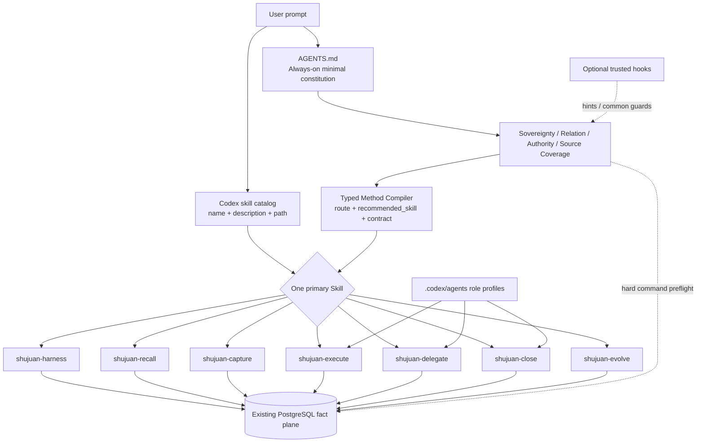
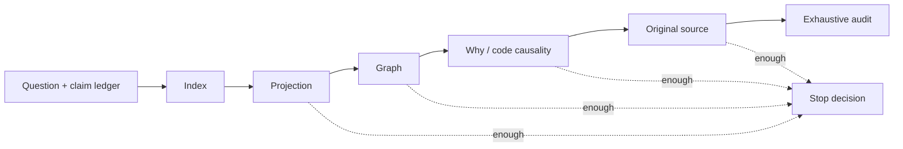
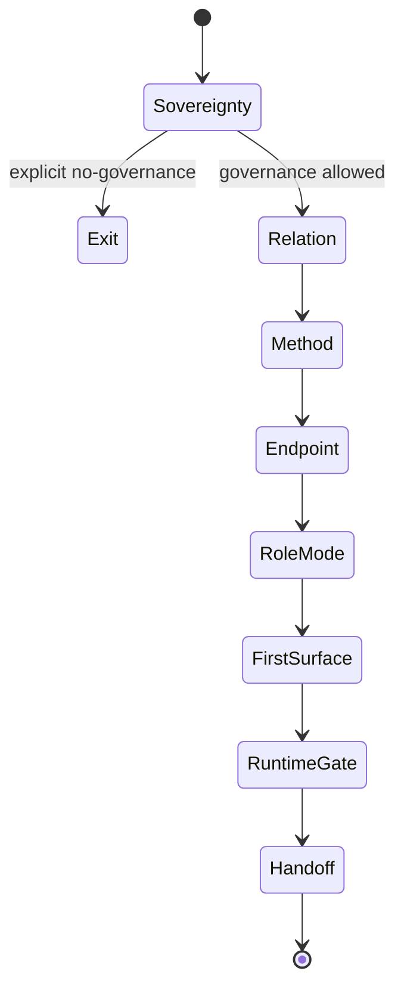

# Shujuan v11 设计：方法论编译层、专家技能分工与注意力控制

**日期：2026-06-25**
**文档性质：基于 v10 clean-use 代码、数据库只读导出、历史演变材料与独立复现实验形成的实施设计**
**目标版本：v11**
**核心结论：v11 不再扩张数据库本体，而是在 v10 本体闸门之上补齐“怎样工作、怎样检索、何时停止、怎样分权”的方法平面。**

---

## 0. 阅读口径与最终判断

本文不用“报告说已经完成”替代事实核查。为避免把推测写成事实，正文使用四类证据标记：

- **[F] 直接事实**：来自当前代码、文件、可重复命令或本次实际运行。
- **[R] 报告性事实**：来自 endpoint/full report、历史报告或分析报告；保留其原始口径，但未必可独立复现。
- **[I] 推断**：由多个事实共同支持的设计判断。
- **[D] 设计决策**：本文为 v11 提出的施工口径，需要通过实施与验收确认。

本次核查得到的最终判断是：

> **v11 的正确升级，不是把 `shujuan-core` 改成一个“总路由 skill”，也不是简单复制出几个目录；而是把 Shujuan 重新分成五个互补平面：常驻政策、按需方法、角色权限、确定性强制、数据库事实。** [I]

原因在于 Codex 的真实加载机制与此前几版草案假设不同：`AGENTS.md` 会在工作开始前进入项目指导链；Skill 只先暴露名称、描述和路径，完整 `SKILL.md` 在被选中后才加载。因此，必须永远生效的主权、权限和证据边界应留在小型 `AGENTS.md` 与命令级验证中；Recall、Execute、Close 等具体工作法才适合拆成并列 Skill。Skill 本身不能授予权限，也不能替代命令层的 fail-closed。[F-CODEX-01][F-CODEX-02][I]

v11 的一句话定义如下：

> **v11 = v10 机器可执行治理本体 + 常驻最小宪法 + 按需专家方法 Skill + DCCP 角色配置 + 确定性方法/权限闸门 + 可验证的注意力与停止规范。** [D]

---

# 1. 问题分析

## 1.1 用户提出的方向，哪些得到事实支持

方向分析报告提出：当前底层结构已经较丰富，下一步应把集中在 `shujuan-core` 中的能力拆成 `shujuan-recall`、`shujuan-harness` 等专家工作法，而不是先增加数据库架构。[R-ANALYSIS-01]

这项判断有三组直接事实支持：

第一，当前 CLI 已经具有 route、endpoint、report、graph、why、workflow、exec、delegate、review、evidence、plan-to-db、artifact、schema 等命令面；Recall、Harness、Close、Delegate 所需的基本原语不是空白。[F-CLI-01]

第二，静态 schema 核查显示当前物理表为 38 张、角色登记为 47 个，默认表面已经限定为 endpoint、task、acceptance check、semantic item、evidence、source document、change set；新增业务表被 schema freeze policy 默认禁止。[F-SCHEMA-01][F-SCHEMA-02]

第三，当前仓库只有一个 repo-local Skill：`.agents/skills/shujuan-core`。它的 description 同时覆盖 recovery、recall、execution、delegation、evidence closeout、route relation、No Governance、task-chain source coverage，确实承担了多个不同工作模式。[F-SKILL-01]

因此，“先压出方法，而不是先增表”是有事实基础的。[I]

但原分析仍有一个需要纠正之处：它把 `shujuan-core` 视为可以继续充当“总激活卡/宪法层”。在真实 Codex 模型中，宪法层应是会常驻加载的 `AGENTS.md`，而不是一个可能未被激活的 Skill；广泛匹配的 `shujuan-core` 还会抢占其他 Skill 的隐式匹配，抵消渐进披露。[F-CODEX-01][F-CODEX-02][I]

## 1.2 当前架构已经具备什么

根据历史演变材料，Shujuan 从 v1 到 v10 的主线不是“增加记忆”，而是逐层暴露并修复 Agent 工作中的隐含前提：

- v1 把目标定为项目本地 Agent 工作治理，核心机制是注意力分配、行为规范和检索路径。[R-HISTORY-01]
- v2 固定 endpoint 是方向级可恢复认知断点，不是完成宣告。[R-HISTORY-02]
- v3 引入语义义务与证据生命周期，并把真实 PostgreSQL 运行作为成功边界。[R-HISTORY-03]
- v4-A 区分 capture、理解、执行与闭环；v4-B 用 AGCP 防止源承诺被弱证据替代。[R-HISTORY-04]
- v5 用 DCCP 区分 controller、worker、reviewer、researcher、writer 的权力与材料边界。[R-HISTORY-05]
- v6-v8 把 activation、friction control、schema stewardship 与轻默认表面固定下来。[R-HISTORY-06]
- v9 把规则产品化为 harness、route guard、原子 importer、机器 JSON、artifact index 与 friction brake。[R-HISTORY-07]
- v10 把 Sovereignty、Relation、Authority、Source Coverage 变成机器可执行闸门。[R-HISTORY-08]

当前 clean-use 代码和文件与这条主线基本对应：根 `AGENTS.md` 第一屏列出四个闸门，默认路线为 Recover、Recall、Execute、Close、Delegate，No Governance 是退出；PostgreSQL 是运行/写入路径，worker/reviewer/provider 输出在 controller adoption 前只是 material。[F-AGENTS-01]

因此 v11 不能重新发明一套与 v10 并列的“新治理真理”。它必须保留 v10 本体，只补“本体之后如何做”的方法论。[I]

## 1.3 当前真正的结构性问题

### 1.3.1 `AGENTS.md`、Skill 和运行时承担的职责没有按 Codex 机制分层

当前根 `AGENTS.md` 为 17,914 bytes、207 行；`shujuan-core/SKILL.md` 为 4,544 bytes、63 行；该 Skill 的 references/templates 合计使相关 Markdown 达到 56,766 bytes。[F-SIZE-01]

Codex 官方文档说明，项目指导文件会在每次运行开始时按目录链合并，默认累计上限为 32 KiB；官方同时建议 `AGENTS.md` 保持小型。当前根文件单独已经占默认上限约 55%，会压缩未来目录级 `AGENTS.md` 和其他项目指导的空间。[F-CODEX-01][F-CODEX-03][I]

与此同时，当前 `AGENTS.md` 含大量命令手册、角色细节、模型选择和高级 fallback；`SKILL.md` 又重复四闸门、First 90 Seconds、五路线和硬边界。常驻政策、工作法、角色配置和命令文档发生重复。[F-AGENTS-01][F-SKILL-01]

问题不是文本“太长”本身，而是不同加载层没有承担适合自己的内容。[I]

### 1.3.2 单一宽描述 Skill 会破坏渐进披露

Codex 初始只加载每个 Skill 的名称、描述和路径，并根据 description 隐式选择；描述应清晰说明触发与不触发边界。[F-CODEX-02]

当前 `shujuan-core` description 包含几乎所有 Shujuan 情景。只要任务与 Shujuan 有关，它都可能匹配。即便新增 `shujuan-recall`，宽泛的 core 仍会与之竞争，Agent 也可能继续加载大而全入口。[F-SKILL-01][I]

所以 v11 不能采用“保留宽泛 core，同时旁边再加几个 Skill”的长期结构。[I]

### 1.3.3 方法仍主要存在于说明文字中，没有统一的机器合同

当前 route guard 已返回 route、mode、first surface、forbidden actions、safe next action 等字段；但 Skill 名称、方法完成条件、允许的路线转换、注意力预算和停止理由没有成为统一的 typed contract。[F-ROUTE-CODE-01]

结果是：

- 同一用户意图会被关键词优先级改变路线；
- Skill 文本可以写出正确边界，但命令层仍可能误判；
- “Recall 做到什么程度算完成”仍依赖自由发挥；
- package/install/doctor 只认识 `shujuan-core`，并不认识一组方法 Skill。[F-PACKAGE-01][I]

### 1.3.4 报告闭环没有覆盖真实语言边界

v10 full report 声称 relation/route regression 覆盖独立审查、No Governance、Close 输入等场景。[R-V10-REPORT-01]

本次在 clean-use 代码上实际运行 11 个 route guard 场景，得到两个反例：

1. `请独立审查这个 worker return 是否足够，不要直接关闭任务。` 的 relation 已被识别为 `independent_review/material_only`，但最终 route 仍变成 `Close`，返回 `missing_closeout_inputs`。
2. 英文 `Independently review ...; do not close the task.` 同样变成 `Close`，且 relation 退化为 `independent_root`。[F-TEST-ROUTE-01]

代码原因是 `_infer_route()` 先判断 `_closeout_execution_intent()`，后判断 `independent_review`；而 `_close_intent()` 能识别 “close/关闭”，没有处理 “do not close/不要关闭” 的否定范围。英文 relation markers 也没有完整覆盖 `independently review` 形式。[F-ROUTE-CODE-02]

这不必然证明报告中的测试虚假；它证明原验收语料未覆盖该否定与语言组合，报告的“通过”不能替代更广的反例测试。[I]

### 1.3.5 当前角色摘要存在静默降权错误

数据库导出的 v9/v10 `endpoint brief --role controller` 均显示：Role 是 `controller`，但 Authority 是 worker 文案，governance write authorized 为 `no`。[F-TEST-ROLE-01]

代码中角色字典只接受 `controller_agent`、`worker_agent` 等完整键；CLI 的 `--role` 没有 choices 或 alias normalization；未知值静默回退到 `worker_agent`，同时输出仍保留原输入 `controller`。[F-ROLE-CODE-01]

这是一个重要方法论问题：角色边界不能只靠手册正确；输入规范化与错误处理必须成为确定性机制。[I]

### 1.3.6 Release 包不能独立证明报告中的全部关闭声明

专家包 README 明确说明它不是闭环验收包，不包含完整数据库；`03_db_sample_surfaces` 是 PostgreSQL 的只读导出。[F-PACK-01]

clean-use release 中没有 test 文件。本次可以复核 manifest、compileall、静态 schema 与不依赖数据库的 route 行为，但不能重跑 endpoint 报告所列的全部 v9/v10 测试，也不能验证当前 live PostgreSQL 状态。[F-TEST-LIMIT-01]

因此本文把 endpoint full report 作为“报告性证据”，不把它等同于独立复现。[I]

## 1.4 一个真实 Recall 任务的运行结果

为测试“老手进入图书馆”的比喻，本次选择真实问题：

> **为什么 No Governance 到 v10 被定义为最高优先级退出，而且它为什么不是第六条 route？**

采用两种入口比较：

### 方法 A：直接全包关键词扫描

在专家包中搜索 `No Governance/no_governance`，候选为 60 个文本文件、601 个命中，候选文件总量 1,987,765 bytes。[F-TEST-RECALL-01]

### 方法 B：按数据库拓扑与因果链定位

先用 project overview 判断 endpoint，再读取 v9/v10 full report、根 `AGENTS.md`、当前 Skill、`route.py`、`sovereignty_gate.py`、`relation_policy.py` 等 9 个关键表面；总量 105,226 bytes、143 个相关命中。[F-TEST-RECALL-01]

候选材料体积减少约 **94.7%**。这不是说 9 个文件永远足够，而是证明 topology-first 的第一轮能显著缩小搜索空间。[I]

沿这条路径得到的可核查结论是：

- 历史上 v4-A 先把 No Governance 定义为合法 mode；v9 增加 friction brake；v10 再将其前置为 sovereignty gate 的最高优先级退出。[R-HISTORY-09]
- 当前 `AGENTS.md` 明确五条默认路线，No Governance 是 no-write/no-capture mode and exit，不是第六条路线。[F-AGENTS-01]
- 实际 route guard 对“不要使用 shujuan，直接回答”返回 No Governance；对“解释为什么 No Governance 不是第六条 route”返回 Recall，说明当前 sovereignty topic/directive 区分在这两个样例中有效。[F-TEST-ROUTE-01]

这个实验支持固定检索方法，但也显示不能把方法写成僵硬的单一路径：搜索问题会随着新证据演化，Agent 需要依据剩余 claim gap 决定下一步，而不是机械读完整库。[I]

## 1.5 v11 要解决的正式问题

v11 的问题可以正式定义为：

> **在不改变 v10 事实本体和 PostgreSQL 主结构的前提下，怎样让 Codex 对每类 Shujuan 工作自动获得正确的最小方法、正确的角色边界、正确的第一表面、明确的完成条件和可审计的停止理由；同时让规则在 Skill 未激活、Hook 未信任或 Agent 使用自然语言否定句时仍然安全。** [D]

---

# 2. 设计背景：v11 必须守住什么

## 2.1 历史主线中不能丢失的原则

v11 必须保留以下六条主线。它们不是“旧版本包袱”，而是多次事故后形成的边界：

1. **Shujuan 是 Agent 工作治理，不是把历史全文塞进上下文。** 目标始终是牵引注意力、行为规范和检索路径。[R-HISTORY-01]
2. **Center + endpoint 是恢复方向的主轴；endpoint 不是完成声明。** [R-HISTORY-02]
3. **机械事实由脚本生成，Agent 做语义判断。** v11 可以让 Agent决定 Recall 是否足够，但不应让 Agent手填 hash、diff、run 或伪造 evidence。[R-HISTORY-01]
4. **完成必须由当前匹配证据和验收链支持。** Readiness、report、review material、Skill 输出都不是 closure 本身。[R-HISTORY-03][R-HISTORY-04]
5. **角色与材料边界不可压缩。** Controller 关闭；worker/reviewer/provider 只返回 material，直到 controller adoption 与独立验证。[R-HISTORY-05]
6. **默认表面轻、内部约束硬。** Contracted/dormant/legacy 不回到默认面；新增表需要独立生命周期和稳定读写路径。[R-HISTORY-06][F-SCHEMA-02]

## 2.2 v10 四闸门是 v11 的前置本体

v10 固定的四项判断必须在任何写入前继续成立：

- Sovereignty：用户是否明确拒绝治理、记录、落库或 capture；
- Relation：请求与既有对象是 continuation、successor、review、revision、fork 还是 independent root；
- Authority：当前角色能否执行当前状态变更；
- Source Coverage：task/check 是否来自 source item 或明确的 synthetic controller rationale。[R-HISTORY-08][F-AGENTS-01]

v11 不为它们增加平行枚举，也不把它们复制进每个 Skill 后各自演化。它们应存在于小型 `AGENTS.md` 与共享 policy service；各 Skill 只引用同一合同。[D]

## 2.3 Codex 的真实机制决定了内容放在哪里

### 2.3.1 `AGENTS.md` 是常驻政策面

Codex 在工作前读取 `AGENTS.md`，并从项目根沿当前目录拼接指导；默认累计上限 32 KiB，越靠近当前目录的指导优先级越高。[F-CODEX-01]

因此，只有以下内容适合放在根 `AGENTS.md`：

- 必须每次生效的四闸门；
- No Governance 退出；
- PostgreSQL 与 material/closure 底线；
- “一次只选择一个 primary method Skill”的规则；
- Skill 选择表与危险状态变更的最小前置条件。[D]

命令大全、完整 role card、历史解释和模板不应常驻。[D]

### 2.3.2 Skill 是按需方法面，不是权限面

Skill 使用渐进披露。Codex 初始只看到 name、description、path；完整内容只在选中后加载，隐式选择依赖 description。[F-CODEX-02]

因此 Skill 的正确职责是：

- 给特定任务提供可重复工作流；
- 包含引用、模板和可选脚本；
- 明确 should trigger / should not trigger；
- 明确 first surface、action chain、completion contract 和 escalation。[D]

Skill 不能因为名字叫 `shujuan-close` 就自动获得 controller 权限；权限必须由 role policy 与命令输入验证。[I]

### 2.3.3 角色应使用 DCCP + Codex custom agent 配置表达

Codex 的 subagent/custom agent 是角色执行面；custom agent 可以定义 instructions、model、reasoning effort、sandbox mode 和 skills config。Subagent 只在显式请求时生成。[F-CODEX-04]

因此，v11 应把“方法”和“角色”正交化：

- Skill 回答“怎么做”；
- custom agent / DCCP packet 回答“谁做、有什么权限”；
- 命令 policy 回答“是否允许真的改变状态”。[D]

当前 `AGENTS.md` 中的详细 role card 与硬编码 worker model 不应继续占据常驻政策面；它们应迁移到 `.codex/agents/*.toml` 和 `shujuan-delegate` 的 packet policy。用户指定模型时仍以用户要求为最高优先。[F-AGENTS-01][D]

### 2.3.4 Hook 是辅助护栏，不是唯一正确性边界

Codex project hooks 只有在项目层被信任后才加载；同一事件的多个 hook 可并发运行。`PreToolUse` 能拦截部分 Bash、apply_patch 与 MCP，但官方明确说明它不是完整执行边界。[F-CODEX-05]

所以 v11 可以用 hook 增加提示或挡住常见危险命令，但不能把 Sovereignty、Authority 或 closure 的正确性仅放在 hook 中。即使 hook 被关闭或未信任，CLI 仍必须 fail-closed。[D]

## 2.4 当前数据库拓扑允许方法升级而无需扩表

当前默认表面已经包含完成 Recall、Execute 与 Close 所需的主要对象：endpoint、task、check、semantic item、evidence、source document、change set；graph、agent run、discussion/capture 与投影对象在支持层存在。[F-SCHEMA-01][F-TOPOLOGY-01]

schema roles 输出同时规定：新增表需要独立 factuality、独立 lifecycle、稳定写路、稳定读路、现有替代不足、不会增加默认认知负担、迁移无漂移和完整测试。[F-SCHEMA-02]

v11 的方法合同、attention frontier、Recall stop decision 首先应作为代码/Skill 输出结构存在，不应因为“想记录方法”就新建业务表。[I]

只有在真实 dogfood 证明它们有独立生命周期、持续查询需求和稳定写读路径后，才重新评估入库。[D]

## 2.5 对现有报告的使用边界

本文采用以下规则：

- endpoint full report 可证明“系统记录了哪些 closure claim”，不能单独证明代码在当前环境仍满足全部 claim；[D]
- 本次可重复命令优先于报告摘要；[D]
- 代码静态阅读能解释行为，但行为结论尽量再配实际运行；[D]
- pack 不含 live DB 或测试源时，明确标注不可复现，不用“closeout ready=yes”替代独立验收。[F-PACK-01][F-TEST-LIMIT-01]

---

# 3. 本次设计方向判断

## 3.1 “图书馆老手”寓言真正说明了什么

图书馆老手并不是把所有书都读一遍，也不是永远按同一条固定命令走。老手拥有四种能力：

1. 先判断问题属于作者、主题、版本、出处、因果还是当前状态；
2. 先用目录、分类号、索引和引用链缩小范围；
3. 每得到一条线索，就更新下一步搜索方向；
4. 知道何时证据已经足以回答，何时必须继续追原文或承认缺口。[I]

信息检索研究中的 berrypicking 模型指出，真实搜索的 query 会随着新材料持续变化，搜索者会在多种来源与策略之间切换；不是一次查询得到单一最终集合。[F-LIT-01]

Information Foraging 则把“information scent”理解为从近端线索估计远端信息的价值、成本和访问路径，并强调在任务约束下提高单位成本获得的有效信息。[F-LIT-02]

因此，v11 不应该把 Recall 写成僵硬的十步流水线；它应该提供一个**有限工具箱 + claim gap 驱动的动态前沿 + 明确停止合同**。[I]

## 3.2 v11 的核心不是“更多 Skill”，而是五平面分离

### 平面一：Policy Plane——常驻最小宪法

载体：根 `AGENTS.md`。
职责：四闸门、No Governance、PostgreSQL、material/closure、primary method 选择原则。
特点：每次运行都生效，尺寸小，不放完整命令手册。[D]

### 平面二：Method Plane——按需专家 Skill

载体：`.agents/skills/shujuan-*`。
职责：Harness、Recall、Capture、Execute、Delegate、Close、Evolve 的操作手册。
特点：按任务加载；每个 Skill 有单一完成合同和清晰排除项。[D]

### 平面三：Role Plane——DCCP 角色与 Codex custom agents

载体：`.codex/agents/shujuan-controller.toml`、worker、reviewer、researcher、writer，以及 delegation packet。
职责：角色指令、sandbox、模型选择、返回格式。
特点：角色不等于方法；reviewer 可以使用 Recall 或 Delegate 方法，但仍没有 closure authority。[D]

### 平面四：Enforcement Plane——共享 policy、CLI 与可选 Hook

载体：`sovereignty_gate.py`、`relation_policy.py`、新的 `method_policy.py`、`role_policy.py`、各命令 preflight、可选 `.codex/hooks.json`。
职责：否定语境、权限、required fields、source coverage、方法转换和危险操作 fail-closed。
特点：Skill 文本写错时，危险命令仍不能越权。[D]

### 平面五：Fact Plane——现有 PostgreSQL 对象与投影

载体：当前 38 张物理表及其 role policy。
职责：source、endpoint、task/check、evidence、run/change、discussion、graph。
特点：v11 P0 不新增表、不恢复 contracted tables。[D]

## 3.3 为什么不能把 `shujuan-core` 简化成“路由器 Skill”

此前草案的“core 只做 router”看似清晰，实际不符合 Codex 加载模型：

- Skill 未必先被激活，不能承担所有任务的前置判断；[F-CODEX-02]
- 一个描述覆盖所有任务的 router Skill 会与每个专家 Skill 竞争；[I]
- 用户可以显式调用某个专家 Skill，仍必须先受 Sovereignty/Authority 约束，这些约束必须在 Skill 之外常驻；[I]
- route guard 是确定性 CLI/policy，适合作为方法编译器；Skill 是工作手册，不应扮演唯一调度器。[I]

因此，v11.0 可保留一个**显式兼容 shim** `shujuan-core`，但 description 必须写明“仅用于 v10 迁移或用户显式 `$shujuan-core`，普通任务不要隐式触发”；v11.1 在迁移验证后删除。[D]

## 3.4 Skill 拆分应按“完成合同”而不是按命令数量

建议 v11 有七个方法 Skill：

1. `shujuan-harness`：入口、恢复、路线/endpoint/mode 选择、runtime preflight；完成时交付“正确 primary method + first surface”，不是完成业务任务。
2. `shujuan-recall`：历史、原则、lineage、版本与 code why；完成时交付“有来源的回答 + 停止决定”，全程只读。
3. `shujuan-capture`：记录 discussion/source，而不自动提升为 task/decision；完成时交付“有 provenance 的 source capture”。
4. `shujuan-execute`：已绑定 task/check 的 scoped 实施；完成时交付“变更 + 测试 + 风险 handoff”，不宣称最终 closure。
5. `shujuan-delegate`：worker/reviewer/researcher/provider material 与 adoption；完成时交付“有状态的 material/return”，不是 evidence closure。
6. `shujuan-close`：controller evidence adoption、check/task closure、endpoint refresh/verify/doctor；完成时才可作 closure claim。
7. `shujuan-evolve`：修改 Shujuan 自身 ontology、schema、policy、skills、hooks、installer、package；完成时要求历史守恒、事故重放、跨表面同步和 release evidence。[D]

No Governance 不是 Skill；它是 Policy Plane 的最高优先级退出。Attention Control 也不是单独 Skill；它是所有方法共享的执行合同。否则 Agent 还要先猜是否激活“注意力 Skill”，又制造一层元路由。[D]

## 3.5 本地 Agent 的边界：它可以决定停止，但不能任意宣称完整

用户提出“Recall 读到哪里算完成，应交给本地执行 Agent”。这个方向正确，但需要把自由裁量放进合同：

本地 Agent 有权根据 claim coverage、矛盾、用户深度和剩余 frontier 判断停止；系统不应硬编码“必须读取 N 个文件”。[D]

同时，Agent 必须输出：

- 已覆盖的核心 claim；
- 每个 claim 的 canonical anchor；
- 已发现的矛盾及处理；
- 明确未搜索的 frontier；
- 停止理由；
- 回答属于 targeted、broad 还是 exhaustive。[D]

它不能在未做全量审计时写“已经穷尽全部历史”；不能把 endpoint summary 当原始方案；不能在 code behavior 问题上只引用设计报告而不看代码或运行。[D]

这使“决策交给 Agent”变成可审计判断，而不是随意收工。[I]

---

# 4. 具体实施方案

## 4.1 总体施工图



施工原则：

- `AGENTS.md` 与 command policy 是硬边界；
- Skill 是按需方法；
- custom agent 是角色；
- Hook 是辅助；
- PostgreSQL schema P0 不变。[D]

## 4.2 目标目录与尺寸

```text
AGENTS.md
.codex/
  agents/
    shujuan-controller.toml
    shujuan-worker.toml
    shujuan-reviewer.toml
    shujuan-researcher.toml
    shujuan-writer.toml
  hooks.json                         # P1，可选、受信任后生效
  hooks/
    shujuan_prompt_method_hint.py
    shujuan_pretool_guard.py
.agents/skills/
  shujuan-harness/
    SKILL.md
    references/first-surface.md
    references/runtime-and-importer.md
  shujuan-recall/
    SKILL.md
    references/search-ladder.md
    references/source-ranking.md
    templates/recall-result.md
  shujuan-capture/
    SKILL.md
    references/capture-extract-consume.md
  shujuan-execute/
    SKILL.md
    references/execute-contract.md
    templates/execution-handoff.md
  shujuan-delegate/
    SKILL.md
    references/roles-and-adoption.md
    templates/worker-return.md
    templates/reviewer-return.md
  shujuan-close/
    SKILL.md
    references/evidence-closeout.md
    templates/closeout-handoff.md
  shujuan-evolve/
    SKILL.md
    references/evolution-gates.md
    references/schema-and-package-impact.md
  shujuan-core/                      # v11.0 compatibility shim only
    SKILL.md
shujuan/
  services/
    method_policy.py
    role_policy.py
  assets/skills/<same tree>
  assets/agents/<role toml files>
tests/
  fixtures/route_method_prompts_v11.jsonl
  fixtures/recall_benchmarks_v11/
  test_method_policy.py
  test_route_guard_v11.py
  test_role_policy.py
  test_skill_installation_v11.py
  test_skill_metadata_v11.py
  test_no_governance_side_effects_v11.py
  test_recall_method_v11.py
  test_hooks_v11.py
```

尺寸是初始工程预算，不是本体真理：

- 根 `AGENTS.md`：**≤ 8 KiB，≤ 120 行**。当前为 17,914 bytes/207 行；目标为至少减半，为目录级指导预留空间。[F-SIZE-01][D]
- 每个 `SKILL.md`：**2–5 KiB，45–90 行**；完整命令说明放 references。[D]
- 每个 description：**≤ 240 characters**，前置触发词并写明主要排除项。[D]
- 七个主 Skill description 总量目标：**≤ 2.5 KiB**，远低于 Codex 初始 Skill 列表 8,000 characters 的上限。[F-CODEX-02][D]
- 每个 first-surface 默认只加载 **1 个** DB/report 表面；确有歧义时最多 2 个。[D]
- 每轮扩展默认最多打开 **3 个**新节点/文件；第三轮必须记录继续原因。[D]

## 4.3 根 `AGENTS.md` 的新边界

根文件应只保留以下结构：

```markdown
# Shujuan Repository Constitution

## Always-on gates
1. Sovereignty...
2. Relation...
3. Authority...
4. Source coverage...

## Invariants
- PostgreSQL runtime/write path.
- Material is not closure evidence before controller adoption.
- Endpoint is a recoverable breakpoint, not completion.
- No Governance exits before DB/trace/filesystem side effects.

## Choose one primary method
- start/resume/route -> $shujuan-harness
- history/why/lineage -> $shujuan-recall
- capture/import discussion -> $shujuan-capture
- implement/fix/change -> $shujuan-execute
- worker/reviewer/provider -> $shujuan-delegate
- evidence/close/doctor -> $shujuan-close
- ontology/schema/skills/hooks/package -> $shujuan-evolve

## Transition rule
Name any transition; do not silently change method or authority.
```

以下内容从根文件迁出：

- 完整 CLI 命令清单；
- 完整 DCCP role cards；
- worker model 硬编码；
- schema advanced fallback；
- provider 细节；
- 长篇术语定义；
- 具体 handoff 模板。[D]

迁出不等于删除：它们分别进入 Skill references、custom agents、CLI help 与现有 DB terms。[D]

## 4.4 方法合同：让 Skill 不再依赖自由发挥

新增 `shujuan/services/method_policy.py`，定义静态、无数据库副作用的 typed contract：

```python
@dataclass(frozen=True)
class MethodContract:
    skill_name: str
    routes: tuple[str, ...]
    write_posture: Literal["none", "source_only", "scoped", "controller_only"]
    allowed_roles: tuple[str, ...]
    first_surface_kind: str
    completion_rule: str
    required_output_fields: tuple[str, ...]
    allowed_transitions: tuple[str, ...]
```

route guard 的输出增加：

```json
{
  "recommended_skill": "shujuan-recall",
  "method_version": "v11",
  "method_contract": {
    "write_posture": "none",
    "completion_rule": "all requested claims anchored or gaps disclosed",
    "required_output_fields": [
      "claim_coverage",
      "anchors",
      "contradictions",
      "unsearched_frontier",
      "stop_reason"
    ],
    "allowed_transitions": ["shujuan-harness", "shujuan-execute"]
  }
}
```

该 service 是方法编译器，不是另一个数据库本体，也不自动执行 Skill。它为 AGENTS、route guard、hook、tests 和 install doctor 提供同一口径。[D]

## 4.5 七个 Skill 的施工规格

### 4.5.1 `shujuan-harness`

**触发**：start、resume、continue、recover、handoff、endpoint 不明、route/mode 不明、runtime readiness、长计划 importer preflight。
**不触发**：明确的历史解释、已绑定实施、独立审查、证据关闭。
**写入姿态**：默认 none；只做 read-only classification/preflight。
**第一表面**：endpoint 已知则 active-only；未知则 project overview 或 endpoint suggest。
**完成条件**：输出唯一 primary Skill、endpoint binding 状态、role/mode、first surface、safe next action；不把“完成路由”说成完成任务。
**允许转换**：所有主 Skill；转换必须显式。
**关键命令**：`route guard`、`report project --overview`、`endpoint suggest`、`install-layout doctor`、`postgres-dev status`、`plan-to-db ... --dry-run`。[D]

建议 description：

```yaml
description: Start, resume, recover, or route a Shujuan task; bind endpoint/role/mode, choose the first surface, check runtime, or preview a task-chain import. Not for history, implementation, review, or closeout.
```

### 4.5.2 `shujuan-recall`

**触发**：history、why、rationale、lineage、version comparison、prior decision、defer/backlog/non-goal、code origin、policy origin。
**不触发**：实现、capture、endpoint refresh、evidence close、任务状态变更。
**写入姿态**：none；不得创建 trace，除非用户明确要求。
**第一表面**：见 4.6 Recall 搜索算法。
**完成条件**：请求中的核心 claims 均有 anchor，矛盾已解决或披露，剩余 frontier 不大可能改变结论，输出 stop decision。
**允许转换**：Harness；用户明确要求基于 Recall 继续实施时转 Execute。
**关键命令**：project/endpoint reports、brief、graph detail/candidates、why path/symbol、artifact index、只读 source/text search。[D]

建议 description：

```yaml
description: Recall Shujuan history, rationale, lineage, version changes, prior decisions, deferred/non-goal items, or why code/policy exists. Read-only; do not capture, execute, refresh, mutate, or close.
```

### 4.5.3 `shujuan-capture`

**触发**：用户明确要求 record/capture/import discussion、保存来源、形成可追溯 source unit，但尚未要求执行或决策。
**不触发**：历史检索、代码实现、任务关闭。
**写入姿态**：source_only。
**第一表面**：当前 session/discussion capture 状态。
**完成条件**：source material 与 provenance 已记录；明确写出“captured ≠ extracted ≠ consumed ≠ closed”。
**允许转换**：只有用户/Controller 明确要求 extract/adopt 时转 Execute 或 Delegate。
**关键命令**：`discuss capture/inbox/status/extract/consume`、`session import`、`hook user-prompt`。[D]

建议 description：

```yaml
description: Capture or import discussion/source material with provenance without turning it into a decision, task, execution run, or closure. Not for historical recall, implementation, or evidence closeout.
```

### 4.5.4 `shujuan-execute`

**触发**：implement、fix、modify、write code/docs/tests，且 endpoint/task/check 已绑定或已通过 Harness preflight。
**不触发**：纯 Recall、独立 review、无输入 closeout、Shujuan 本体升级。
**写入姿态**：scoped。
**第一表面**：endpoint active-only + 目标 task/check；数据库 readiness。
**完成条件**：scoped change、focused verification、changed files、影响与 unresolved risks 已交付；没有最终 closure claim。
**允许转换**：Delegate（需要外部实施/审查）、Close（controller 取证后）。
**关键命令**：`workflow begin`、`exec start`、实施工具、tests、`exec stop`。[D]

建议 description：

```yaml
description: Execute scoped implementation already bound to a Shujuan endpoint/task/check: begin workflow, start run, modify, test, and hand off. Not for route selection, independent review, ontology changes, or final closeout.
```

### 4.5.5 `shujuan-delegate`

**触发**：worker/reviewer/researcher/writer/provider packet、subagent handoff、independent review、return import、controller adoption。
**不触发**：普通执行或最终 closure。
**写入姿态**：material/adoption；不直接关闭。
**第一表面**：目标 endpoint/task/check + role packet。
**完成条件**：packet_generated/reviewer_executed/controller_adopted 等状态清晰；return 有 changed files/tests/impact/risks；material 与 evidence 未混淆。
**允许转换**：Execute 或 Close，但只有 controller adoption 后。
**关键命令**：delegate packet/review/import、review start/record-return/adopt、audit import-agent-output。
**Codex 边界**：Skill 不宣称已启动 subagent；Codex subagent 只在用户/Controller 明确要求时 spawn。[F-CODEX-04][D]

建议 description：

```yaml
description: Prepare or consume worker/reviewer/researcher/provider packets, independent reviews, returns, and controller adoption. Material-only until verified; not for implementation ownership or direct closure.
```

### 4.5.6 `shujuan-close`

**触发**：evidence adoption、close check/task、endpoint refresh、evidence verify、strict doctor、completion claim。
**不触发**：没有 endpoint/task/check/evidence 输入的“测试过了，关掉”；review material sufficiency 仍属 Delegate。
**写入姿态**：controller_only。
**第一表面**：明确的 endpoint、task、check、expected evidence type、current matching evidence ref。
**完成条件**：evidence current/matching，check/task 依赖满足，endpoint refreshed，verify 与 strict doctor 通过；残余项显式记录。
**允许转换**：阻塞时回 Harness/Execute/Delegate。
**关键命令**：evidence test-result/artifact/user-confirmation、endpoint refresh、evidence verify、endpoint doctor。[D]

建议 description：

```yaml
description: Controller-only evidence adoption and closeout for explicit endpoint/task/check/evidence inputs, including refresh, verify, strict doctor, and completion claim. Not for review material or guessed closure.
```

### 4.5.7 `shujuan-evolve`

**触发**：修改 Shujuan ontology、relation/authority policy、schema、migration、Skill、AGENTS、hook、installer、package/release。
**不触发**：普通项目实施。
**写入姿态**：controller/maintainer scoped；高风险。
**第一表面**：历史 changelog + 当前 AGENTS/相关 Skill + schema roles + 事故复现 + why/code path。
**完成条件**：历史原则守恒、反例被重放、所有镜像/安装/包清单同步、focused tests + clean install + live PostgreSQL 验收、无 false closure。
**允许转换**：Close；必要时 Delegate reviewer。
**硬边界**：新表必须通过现有八项 admission gates；hook 不得成为唯一强制边界；不得仅加厚 AGENTS/SKILL 解决问题。[F-SCHEMA-02][D]

建议 description：

```yaml
description: Evolve Shujuan itself—ontology, policies, schema/migrations, AGENTS, skills, hooks, installer, packaging, or release. Requires history preservation, incident replay, cross-surface sync, and release evidence.
```

## 4.6 Recall 的专家工作手册

### 4.6.1 先建立 Claim Ledger，而不是先搜索

Agent 先把问题拆成至多 5 类 claim：

- **Current**：当前实现/状态是什么；
- **Historical**：它何时、在哪个版本形成；
- **Causal**：为什么改变，源承诺或事故是什么；
- **Boundary**：它不意味着什么、什么不能混淆；
- **Contradiction**：报告、代码、运行结果是否不一致。[D]

只有 claim 明确，才能判断某个新文件是否值得打开。[I]

### 4.6.2 搜索梯级不是固定流水线，而是可选择的工具架



**L0：Index——定位方向**
endpoint 明确：直接进入相关表面。endpoint 不明：project overview、endpoint suggest、artifact index。目标是选“书架”，不是读内容。[D]

**L1：Projection——读取最小可用投影**
当前义务/恢复：active-only。单 endpoint 历史：full。角色行动面：brief，但 role 必须规范化。跨 endpoint：project report。[D]

**L2：Graph——追对象关系**
用 graph detail/candidates 从 task/check/semantic/source/change 的边连接，判断前驱、替代、来源和受影响对象。[D]

**L3：Why——追代码因果**
涉及代码或规则来源时使用 `why --path` / `why --symbol`，沿 code object → change set → agent run → diff hunk → source material 追踪。[D]

**L4：Original Source——回到原始方案或来源文本**
当报告只给摘要、claim 有争议或用户要求阶段原则时，必须读 source document/original plan，不能用后来的 recall 报告代替原文。[D]

**L5：Exhaustive Audit——受控全量审计**
只有三种触发：用户明确要求穷尽；关键来源互相矛盾；高风险结论仍缺 provenance。此时才使用全库 text search、跨 endpoint 扫描或完整代码检索。[D]

### 4.6.3 Frontier 选择规则

每个候选动作按三项判断：

- 对未覆盖 claim 的预期信息价值；
- 访问与阅读成本；
- 能否提供更 canonical 的来源或解决矛盾。[D]

优先选择“高 claim coverage、低成本、接近 canonical source”的动作。上一轮发现新概念时允许改变检索策略，这对应 berrypicking 的 evolving search，而不是失败。[F-LIT-01][I]

### 4.6.4 默认注意力预算

- first surface：1 个；
- 每轮：最多 3 个 frontier item；
- 默认两轮；
- 第三轮需写明 `continue_reason`：contradiction、missing_provenance、cross_endpoint 或 user_exhaustive；
- 不设固定“最多读 N 文件”硬上限；高风险或明确穷尽请求可升级，但必须可解释。[D]

### 4.6.5 Recall 完成判定

Recall 可以停止，当且仅当：

1. 用户问题中的每个核心 claim 已有至少一个适合其类型的 anchor；
2. 涉及运行行为的 claim 有代码或实际运行支持，不能只靠设计报告；
3. 影响结论的矛盾已解决，或在答案中明确披露；
4. 剩余 frontier 不大可能改变主结论，或继续成本明显高于预期增益；
5. 已满足用户要求的深度；
6. 输出中明确 targeted/broad/exhaustive 等级。[D]

标准返回结构：

```markdown
## Recall result
- Scope: targeted | broad | exhaustive
- Claims covered: ...
- Canonical anchors: ...
- Contradictions: resolved | disclosed
- Unsearched frontier: ...
- Stop reason: sufficient_coverage | diminishing_return | blocked_missing_source
- Confidence: high | medium | low, with reason
```

这里的 stop decision 由本地 Agent 作出；CLI 只校验字段完整和禁止错误的 exhaustive claim，不代替语义判断。[D]

## 4.7 Harness 的方法手册

Harness 的 First 90 Seconds 应变为可执行状态机，而不是重复在 AGENTS 与 Skill 中写九条：



输出必须包含：

- `sovereignty_decision`；
- `relation_decision`；
- `recommended_skill`；
- `endpoint_binding`：bound/candidate/unbound；
- `role` 与 `mode`；
- `first_surface`；
- `write_posture`；
- `safe_next_action`；
- `forbidden_next_actions`；
- `transition_reason`。[D]

Harness 不自动串联所有 Skill。它完成后，Agent选择一个 primary Skill；后续切换必须显式写出“从 X 转到 Y，因为……”。[D]

## 4.8 注意力控制：共享合同，不做第八个 Skill

每个 Skill 必须使用同一 Attention Contract：

```yaml
primary_method: shujuan-recall
endpoint: bound | candidate | unbound
role: controller_agent | worker_agent | reviewer_agent | researcher_agent | writer_agent
mode: no_governance | capture | explore | light | standard | full
first_surface_budget: 1
frontier_limit_per_round: 3
write_posture: none | source_only | scoped | controller_only
completion_contract: ...
transition_target: null | <skill>
transition_reason: null | <reason>
```

注意力控制包含四个默认动作：

1. **先选一个 primary method**，避免同时执行 Recall、Execute、Close；
2. **先读最小表面**，再因 claim gap 扩展；
3. **inactive/deferred/backlog 默认不占当前注意力**，除非用户提升或当前 claim 需要；
4. **每次转换重新检查 authority 与 write posture**。[D]

这继承 v1 的注意力治理、v3 的 active lifecycle、v6 的 activation-first 和 v7 的 friction control，而不是新造平行概念。[R-HISTORY-01][R-HISTORY-03][R-HISTORY-06][I]

## 4.9 角色平面的实施

新增五个 project-scoped custom agent：

- `shujuan-controller.toml`：治理编排、状态写入与最终 close；
- `shujuan-worker.toml`：scoped implementation，返回 material；
- `shujuan-reviewer.toml`：read-only sandbox，独立审查；
- `shujuan-researcher.toml`：read-heavy、事实/推断分离；
- `shujuan-writer.toml`：prose only，默认 No Governance，除非 controller 采纳。[D]

角色文件负责模型、reasoning effort、sandbox 与 developer instructions。根 AGENTS 只保留一句“controller closes; delegated roles return material”。[D]

`shujuan-delegate` packet 明确 requested role 与 recommended custom agent；但 packet_generated 不等于 subagent 已经运行，reviewer_executed 只有真实 return artifact 后才为 true。[F-CODEX-04][D]

## 4.10 Hook 的最小、安全方案

### P0：不依赖 Hook

v11 P0 的四闸门、role normalization、Close required fields、source coverage、No Governance no-side-effect 必须在 Python policy/CLI 中通过测试。Hook 全部关闭时系统仍正确。[D]

### P1：两个可选 Hook

1. **UserPromptSubmit method hint**
   调用一个纯函数/纯 CLI `route guard --pure`，不连接 DB、不创建 `.shujuan`，输出 `recommended_skill` 与 No Governance/Relation 提示，作为 additional developer context。官方允许 UserPromptSubmit 添加 additionalContext。[F-CODEX-05][D]

2. **PreToolUse common guard**
   对明显的 Shujuan 写命令检查 No Governance、controller-only command 和 required ids；可 deny 常见危险调用。由于官方说明 PreToolUse 拦截不完整，它只能作为第二道护栏。[F-CODEX-05][D]

P0/P1 均不建议启用 Stop hook：Stop 容易在 completion contract 不明确时制造循环；应先用 eval 证明需求，再进入 P2。[D]

## 4.11 必须先修复的两个 v10 缺口

### 修复 A：否定感知的 route intent

改造 `route.py`：

1. 先用 sovereignty 和 relation decision；
2. 把 intent 解析为 typed facts：`asks_recall`、`asks_review`、`asks_close`、`negates_close`、`asks_execute`；
3. `independent_review` 在没有明确正向 closeout 指令时优先 Delegate；
4. `_close_intent` 对 `不要关闭`、`不关闭`、`do not close`、`don't close`、`without closing` 做范围否定；
5. 增加 `independently review`、`independent check`、`separate review` 等英文 regex；
6. route guard 输出解析出的 intent facts，便于审计。[D]

必须通过本次两个反例，且完整 closeout inputs 仍能进入 Close。[D]

### 修复 B：角色别名与未知角色 fail-closed

新增 `role_policy.py`：

```python
ROLE_ALIASES = {
    "controller": "controller_agent",
    "worker": "worker_agent",
    "reviewer": "reviewer_agent",
    "researcher": "researcher_agent",
    "writer": "writer_agent",
}
```

`endpoint brief --role controller` 必须规范化为 controller_agent；未知角色返回结构化 `invalid_role`，不得静默回退 worker。[D]

## 4.12 安装、打包和镜像施工

当前单 Skill 假设硬编码在以下位置：

- `pyproject.toml` 只打包 `assets/skills/shujuan-core/*`；
- `shujuan/cli.py` 的模板、resource root、安装目录只认识 core；
- `commands/init.py` 的 `--install-skill` 只说明 core；
- `commands/install_layout.py` 只检查 core；
- `commands/delegate_handlers.py` 的 `must_read` 固定 core；
- README、AGENTS、MANIFEST 与 build assets 均含 core 路径。[F-PACKAGE-01]

因此“建几个目录”不是完成。实施需要：

1. 新增一个 skill registry，列出 required/optional Skill、description、version、asset path；
2. `init --install-skills` 安装全部 required Skill；保留 `--install-skill` 作为一个版本的兼容别名；
3. `install-layout doctor` 输出每个 Skill 的 present/hash/version/metadata status；
4. delegate packet 的 `must_read` 根据角色与方法选择，例如 reviewer 读取 `shujuan-delegate` + `shujuan-recall`，不是全部 Skill；
5. `pyproject.toml` package-data 改为覆盖所有 Skill、custom agents 和可选 hooks；
6. `.agents/skills` 与 `shujuan/assets/skills` 由测试验证逐文件同步；
7. 更新 MANIFEST 与 verifier；
8. clean repo init smoke 证明安装后 Codex 可发现全部 Skill。[D]

## 4.13 分阶段施工计划

### P0：基线与反例固定

产物：

- 保存本次 route 反例和 controller role bug 为 regression fixtures；
- 记录当前 38 tables/47 roles、manifest、AGENTS/SKILL 尺寸；
- 建立 72 条 route/method 语料；
- 建立 12 个 Recall benchmark。[D]

退出条件：当前反例在旧代码上可重复失败，测试不是“写完即绿”。[D]

### P1：共享 policy 修复

产物：

- 否定感知 route intent；
- role normalization；
- `method_policy.py`；
- route guard 增加 `recommended_skill` 与 method contract；
- `--pure` 分类路径不连接 DB、不写 trace/filesystem。[D]

退出条件：route 与 role regression 全绿；No Governance 零副作用。[D]

### P2：AGENTS 收缩与七 Skill 落地

产物：

- 根 AGENTS ≤8 KiB；
- 七个 Skill 及 references/templates；
- core compatibility shim；
- description collision tests；
- Attention Contract 与 Recall stop template。[D]

退出条件：AGENTS 常驻原则无遗漏；每个测试 prompt 有唯一 primary Skill 或 No Governance。[D]

### P3：角色面与安装/打包

产物：

- 五个 custom agent TOML；
- registry-driven installer；
- install doctor；
- package-data/MANIFEST/README 更新；
- clean install smoke。[D]

退出条件：空 repo 初始化后全部 required Skill 与 agents 文件存在；release manifest 通过。[D]

### P4：可选 Hook

产物：

- pure method hint hook；
- common pretool guard；
- trust-off/disabled fallback tests。[D]

退出条件：Hook 未信任或关闭时，核心测试仍全绿；Hook 开启时不制造 No Governance 侧效应。[D]

### P5：真实 PostgreSQL dogfood 与 closeout

产物：

- 12 个 Recall 真实任务记录；
- route/method metrics；
- live migration/schema status；
- Execute/Delegate/Close 端到端；
- endpoint refresh、evidence verify、strict doctor；
- 两个独立 reviewer returns 与 controller adoption。[D]

退出条件：满足 4.14 验收矩阵后才能宣称 v11 完成。[D]

## 4.14 验收矩阵

### 4.14.1 Codex surface

- 根 AGENTS ≤8 KiB、≤120 行；四闸门、No Governance、PostgreSQL、material/closure、Skill map 均在前 4 KiB 内。[D]
- 七个主 Skill description 总量 ≤2.5 KiB，且每个都有 should/not trigger。[D]
- `shujuan-core` 不会对普通任务隐式触发；v11.1 可删除。[D]
- Skill 与 assets 镜像完全一致。[D]

### 4.14.2 Route / method

72 条最小语料建议组成：

- 七个 Skill 各 6 条正例：42；
- route/skill overlap 与否定句：18；
- No Governance directive/meta topic 双语边界：12。[D]

指标：

- primary Skill top-1 正确率 ≥95%；
- No Governance directive false negative = 0；
- No Governance meta-topic false positive = 0；
- controller-only dangerous transition false allow = 0；
- 本次两个 independent-review + negated-close 反例必须 Delegate；
- 完整 closeout inputs 必须 Close。[D]

### 4.14.3 Recall

12 个 benchmark 至少包含：

- 3 个阶段历史/原则；
- 3 个 code why；
- 2 个跨 endpoint lineage；
- 2 个报告与代码矛盾；
- 2 个 current vs historical 状态区分。[D]

指标：

- 核心 claim 有 anchor：100%；
- unsupported factual assertion：0；
- 报告性证据被正确标注：100%；
- 在非 exhaustive 任务中，候选材料中位数相对 naive 全文扫描减少 ≥70%；
- 每个结果都有 unsearched frontier 与 stop reason；
- Recall 过程 DB writes = 0。[D]

本次单例已观察到 94.7% 的候选字节缩减，可作为基线但不能替代 12 项 benchmark。[F-TEST-RECALL-01][I]

### 4.14.4 Role / authority

- `controller` 与 `controller_agent` 输出一致；
- 未知 role 结构化失败；
- reviewer/worker/provider material 不直接关闭；
- custom reviewer agent 默认 read-only sandbox；
- Skill 激活不改变角色权限。[D]

### 4.14.5 Runtime / schema / release

- 静态 schema 仍为 38 tables/47 roles，P0 无 migration；
- live PostgreSQL migration/status/schema roles 通过；
- SQLite 仍 fail-closed；
- manifest verifier、compileall、clean init、package install 通过；
- Hook disabled/untrusted 仍通过核心验收；
- endpoint closeout 需要当前 matching evidence。[D]

## 4.15 兼容迁移与回滚

### v11.0

- 安装七个主 Skill；
- 保留显式兼容 `shujuan-core`；
- `--install-skill` 映射到 `--install-skills` 并给 deprecation warning；
- 旧 packet 中的 core must_read 仍能解析，但新 packet 用 method-specific Skill；
- DB 无迁移。[D]

### v11.1

当真实使用日志证明没有必要依赖 core 后：

- 删除 core shim；
- 删除旧安装别名；
- 更新 artifact index 与文档。[D]

### 回滚

回滚只恢复旧 AGENTS、core Skill、installer/assets 与 route policy；由于 P0 不改 schema，数据库无需逆迁移。任何已生成的新 packet/artifact 仍作为 material 保留，不自动删除。[D]

## 4.16 主要风险与防错

1. **Skill 过多导致选择冲突**：用短 description、唯一完成合同、72 条 collision eval 和 route guard `recommended_skill` 控制。[D]
2. **AGENTS 收缩导致旧边界丢失**：建立 invariant checklist；四闸门和 closure 边界必须在前 4 KiB；references 不作为唯一安全来源。[D]
3. **Hook 被误当硬安全层**：核心 command preflight 不依赖 hook；trust-off 测试是 release gate。[D]
4. **Recall 手册变成机械 checklist**：使用 claim/frontier/stop contract，允许策略随证据变化。[D]
5. **Agent 太早停止**：强制列出 unsearched frontier 和 contradiction；高风险 claim 需代码/运行或原始 source。[D]
6. **Agent 读完整库**：first-surface/round budget + exhaustive trigger；大范围扫描必须有继续理由。[D]
7. **方法与角色再次混在一起**：Skill 不含模型授权；custom agents 不定义 closure 逻辑；命令 policy 最终裁决。[D]
8. **仅改 repo Skill，安装包继续旧结构**：registry、assets sync、clean init、manifest 都列为同一 task chain 的硬检查。[D]

## 4.17 v11 应交付的完整成品

v11 不是“写完七份 SKILL.md”。完整交付至少包括：

- 收缩后的 AGENTS；
- 七个主 Skill 与 core 兼容 shim；
- custom agent role profiles；
- method/role policy；
- route/role 两项前置修复；
- registry-driven installer/doctor/package；
- 可选 hooks；
- 72 条 route/method eval；
- 12 个 Recall benchmark；
- clean install、manifest、compileall、live PostgreSQL、endpoint closeout evidence；
- v10→v11 migration note 与术语表。[D]

---

# 5. 术语定义附录

## 5.1 Policy Plane

每次 Codex 运行都必须生效的最小项目政策。载体是 `AGENTS.md` 与确定性命令闸门，不包含完整工作手册。[D]

## 5.2 Method Plane

针对一类任务的可重复操作方法。载体是 Skill；定义触发、第一表面、动作链、完成合同、停止理由和允许转换。[D]

## 5.3 Role Plane

定义谁在做、拥有什么权限、使用什么 sandbox/model、返回什么 material。载体是 DCCP packet 与 Codex custom agent 配置。[D]

## 5.4 Enforcement Plane

确保自然语言说明未被遵守时，危险操作仍 fail-closed 的代码层。包括 sovereignty/relation/method/role policy、CLI preflight 和辅助 hooks。[D]

## 5.5 Fact Plane

Shujuan 的 PostgreSQL 事实、来源、义务、证据、执行和投影对象。v11 P0 不改变其 38-table 物理结构。[F-SCHEMA-01][D]

## 5.6 Primary Method

当前一轮 Agent 工作唯一的主方法 Skill。允许显式转换，但不允许同时把 Recall、Execute、Close 当作同一入口。[D]

## 5.7 Method Contract

一个方法的机器可读边界：Skill、route、write posture、allowed roles、first surface、completion、required output、allowed transitions。[D]

## 5.8 Attention Contract

控制上下文扩张与行为转换的共享合同，包括 primary method、endpoint、role/mode、first surface budget、frontier、write posture、completion 和 transition reason。[D]

## 5.9 Claim Ledger

Recall 开始时建立的问题断言清单。通常分 current、historical、causal、boundary、contradiction，用来决定下一项材料是否有价值。[D]

## 5.10 Recall Frontier

尚未读取、但可能补足 claim 或解决矛盾的候选节点、文件、报告、source 或代码路径。[D]

## 5.11 Information Scent

由近端线索估计一个候选来源的相关价值、访问成本和可能路径；在 v11 中用于给 Recall frontier 排序，而不是作为概率真理。[F-LIT-02][D]

## 5.12 Recall Stop Decision

本地 Agent 对“为什么现在足以停止”的结构化判断；必须含 coverage、anchors、contradictions、unsearched frontier、scope level 和 stop reason。[D]

## 5.13 Harness Completion

Harness 的完成不是业务完成，而是已经确定 sovereignty/relation、primary method、endpoint/role/mode、first surface 与下一安全动作。[D]

## 5.14 Capture

将 discussion/source 作为有 provenance 的 source unit 保存；不自动等于理解、task、decision、execution 或 closure。[R-HISTORY-04]

## 5.15 Material

worker、reviewer、researcher、writer、provider 的返回。只有经 controller adoption、独立验证并匹配 check/evidence 后，才可能进入 closure。[R-HISTORY-05]

## 5.16 Closure

在当前 scope 下，由当前匹配 evidence 关闭 acceptance check/task，并经过 endpoint refresh、verify、strict doctor 的 controller claim；不是“报告干净”或“测试文字说通过”。[R-HISTORY-03][R-HISTORY-04]

## 5.17 Compatibility Shim

v11.0 暂时保留的 `shujuan-core` 显式迁移入口。它不参与普通任务的隐式匹配，不拥有新权威，v11.1 计划移除。[D]

## 5.18 Shujuan Evolve

修改 Shujuan 自身 ontology、policy、schema、skills、hooks、installer 或 package 的专门方法。它不同于普通项目 Execute，因为必须验证历史守恒、跨表面同步和 release contract。[D]

---

# 附录 A：证据索引

## A.1 用户提供材料

- **[R-HISTORY-01]** `shujuan-history-changelog.md`，§2，尤其 45–65 行：v1 是工作治理；注意力、行为规范、检索路径。
- **[R-HISTORY-02]** 同文件，§3：endpoint 是方向级可恢复认知断点。
- **[R-HISTORY-03]** 同文件，§4：lifecycle、PostgreSQL success、evidence lifecycle。
- **[R-HISTORY-04]** 同文件，§5–6：capture/understand/execute/close 分层与 AGCP。
- **[R-HISTORY-05]** 同文件，§7：DCCP、角色与 material/closure。
- **[R-HISTORY-06]** 同文件，§8–10：activation-first、friction control、schema stewardship。
- **[R-HISTORY-07]** 同文件，§11，635–709 行：v9 harness、First 90 Seconds、friction brake。
- **[R-HISTORY-08]** 同文件，§12，711–785 行：v10 四闸门与机器本体。
- **[R-HISTORY-09]** 同文件，853–859 行：No Governance 从 v4-A mode 到 v9 brake、v10 sovereignty exit。
- **[R-ANALYSIS-01]** `shujuan-skill-direction-analysis-2026-06-25(1).md`，5–22、30–55 行：拆 Skill 与图书馆方法的原始假设。本文将其视为待验证判断，不视为完成事实。

## A.2 专家包与代码

包根：`shujuan-expert-review-pack-2026-06-25-current-architecture/`

- **[F-PACK-01]** `00_README.md`：包是架构判断材料，不是闭环验收包；无完整 DB。
- **[F-CLI-01]** clean-use 根运行 `python -m shujuan --help`，exit 0；命令面含 route/endpoint/report/graph/why/evidence/workflow/exec/delegate/review/plan-to-db/schema 等。
- **[F-SCHEMA-01]** 本次运行 `python -m shujuan schema verify`，exit 0：38 physical tables、47 role registry、9 contracted tables absent、default surface governance_objects。
- **[F-SCHEMA-02]** 本次运行 `python -m shujuan schema roles --advanced`，exit 0：26 core_fact、4 support、4 capture support、1 projection cache、3 dormant、9 contracted；business table additions false。
- **[F-TOPOLOGY-01]** `02_db_topology/topology.mmd` 与 `topology_notes.md`：User intent → gates/routes → PostgreSQL objects/material adoption。
- **[F-AGENTS-01]** clean-use `AGENTS.md`，11–16、32–44、46–56、58–121、164–207 行。
- **[F-SKILL-01]** `.agents/skills/shujuan-core/SKILL.md`，1–63 行。
- **[F-SIZE-01]** 本次 byte/line 统计：AGENTS 17,914/207；Skill 4,544/63；AGENTS + Skill refs/templates 56,766 bytes。
- **[F-ROUTE-CODE-01]** `shujuan/commands/route.py`，214–271 行：route inference 与 first surface。
- **[F-ROUTE-CODE-02]** 同文件，38–52、98–125、214–233 行：Close regex、review patterns 与优先级。
- **[F-ROLE-CODE-01]** `shujuan/commands/endpoint.py`，557–603、2208–2215 行：角色字典、worker fallback、无 role choices。
- **[F-PACKAGE-01]** `pyproject.toml` 18–25 行；`shujuan/cli.py` 704、950–1006；`commands/init.py` 140–147；`install_layout.py` 43/100；`delegate_handlers.py` 255；以及 README/MANIFEST 的 core hardcode。
- **[R-V10-REPORT-01]** `03_db_sample_surfaces/v10_ontology_relation_gate_full.md`，28–55 行的 closure claims。由于包无 tests/live DB，本项为报告性证据。
- **[F-TEST-ROLE-01]** `03_db_sample_surfaces/v9_agent_enable_harness_controller_brief.md` 与 `v10_ontology_relation_gate_controller_brief.md`：`--role controller` 输出 worker authority。
- **[F-TEST-LIMIT-01]** clean-use 中 test-like 文件数为 0；本地 PostgreSQL 未随包提供。

## A.3 本次实际实验

- **[F-TEST-ROUTE-01]** `/mnt/data/shujuan_v11_work/route-tests-2026-06-25/aggregate.json`。11 个实际 route guard 场景；其中两个 independent review + negated close 误路由 Close；No Governance directive/topic 区分样例通过。
- **[F-TEST-RECALL-01]** `/mnt/data/shujuan_v11_work/recall-experiment-metrics.json`。naive：60 files/1,987,765 bytes；topology-guided：9 files/105,226 bytes；候选体积减少约 94.7%。
- 本次 release verification：`verify_release_manifest.py` exit 0，146 files、missing 0、bad hash 0；`compileall` exit 0；`install-layout doctor` exit 0，但 PostgreSQL ready=false，且只检查 core Skill。[F]

## A.4 Codex 官方机制

- **[F-CODEX-01]** OpenAI Codex `AGENTS.md` 文档：运行前读取；根到 cwd 合并；默认累计 32 KiB。
  https://developers.openai.com/codex/guides/agents-md
- **[F-CODEX-02]** OpenAI Codex Skills 文档：渐进披露；初始为 name/description/path；完整 Skill 按需；初始列表上限 2% context 或 8,000 chars；隐式匹配依赖 description。
  https://developers.openai.com/codex/skills
- **[F-CODEX-03]** OpenAI Codex Customization：AGENTS 是持久指导且应保持小型；Skills 是可复用工作流，两者互补。
  https://developers.openai.com/codex/concepts/customization
- **[F-CODEX-04]** OpenAI Codex Subagents：subagent 需显式请求；custom agent 支持 model、instructions、sandbox 与 skills config。
  https://developers.openai.com/codex/subagents
- **[F-CODEX-05]** OpenAI Codex Hooks：project hooks 需信任；多个 hook 可并发；UserPromptSubmit 可添加 context；PreToolUse 可 deny 部分工具，但不是完整 enforcement boundary。
  https://developers.openai.com/codex/hooks

## A.5 检索方法文献

- **[F-LIT-01]** Marcia J. Bates, “The Design of Browsing and Berrypicking Techniques for the Online Search Interface,” 1989：真实检索是 evolving/berrypicking，会切换来源和技术。
  https://pages.gseis.ucla.edu/faculty/bates/articles/berrypicking.pdf
- **[F-LIT-02]** Peter Pirolli & Stuart Card, “Information Foraging,” 1999：information scent 与单位成本信息价值。
  https://act-r.psy.cmu.edu/wordpress/wp-content/uploads/2012/12/280uir-1999-05-pirolli.pdf

---

# 附录 B：本次核查命令摘要

```bash
python scripts/verify_release_manifest.py .
python -m compileall -q shujuan
python -m shujuan --help
python -m shujuan schema verify
python -m shujuan schema roles --advanced
python -m shujuan install-layout doctor
```

结果：上述命令均 exit 0；install doctor 显示 package/skill/state layout 正常，但 PostgreSQL 未启动且当前只识别 `shujuan-core`。[F]

Route guard 代表性重放：

```bash
python -m shujuan route guard \
  --intent '请独立审查这个 worker return 是否足够，不要直接关闭任务。'

python -m shujuan route guard \
  --intent 'Independently review whether this worker return is sufficient; do not close the task.'

python -m shujuan route guard \
  --intent '不要使用 shujuan，也不要关闭任务，直接回答。'

python -m shujuan route guard \
  --intent '解释为什么 No Governance 不是第六条 route。'
```

前两条误入 Close；第三条为 No Governance；第四条为 Recall。[F-TEST-ROUTE-01]

---

# 结案判断

本次设计没有接受“把一个大 Skill 拆成几个目录就算 v11”的简化结论，也没有把 `shujuan-core` 误设为必须先运行的 Skill 路由器。

v11 真正需要完成的是：

1. 保留 v10 四闸门与数据库事实本体；
2. 让 AGENTS、Skill、角色、Hook、CLI 各自在 Codex 的真实机制中承担正确职责；
3. 把七类工作写成有触发、有第一表面、有完成条件、有停止理由的方法合同；
4. 用实际反例修复自然语言路由和角色降权；
5. 用 Recall benchmark 证明“读得更少但证据更强”，而不是依赖感觉；
6. 用安装、打包、live PostgreSQL 和 closeout evidence 证明整个 v11，而不是只证明文档存在。[D]

这才是从 v10“本体论补全”迈向 v11“方法论补全”的完整方向。
